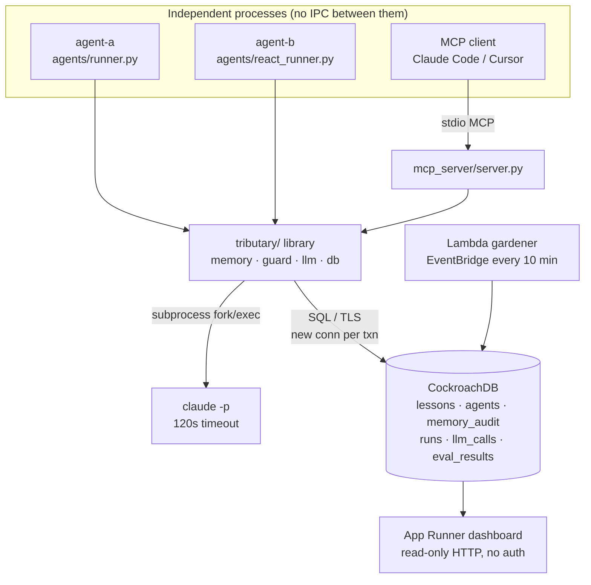

# Tributary: Deep Dive

> **Scope note (2026-09-04).** This document audits the **CockroachDB-era**
> code at commit `cd88824`. The repository has since been ported to
> PostgreSQL + pgvector. Everything about the write path, the classifier,
> the guard, the evals, and the agents still holds. What changed:
>
> - **The vector index is now used.** §8/§12 found that the shipped cosine
>   query (`<=>`) ignored the L2 `VECTOR INDEX`. The Postgres schema builds a
>   partial HNSW index (`vector_cosine_ops`, `WHERE status = 'active'`);
>   `EXPLAIN` on the shipped `recall()` query shows
>   `Index Scan using lessons_active_embedding_idx` at 3k rows.
> - **Time travel no longer uses `AS OF SYSTEM TIME`.** Lessons carry
>   `activated_at` / `deactivated_at`, stamped in the same transaction as the
>   status change, and `recall_as_of` filters on them (parameterized, so the
>   §9 "SQL injection via AS OF" note is moot). The history is not bounded by
>   a GC window.
> - **Isolation is explicit.** Postgres defaults to READ COMMITTED;
>   `db.connect()` sets SERIALIZABLE and `tests/test_conflicts.py` pins it.
> - `STRING`→`TEXT`, `CREATE DATABASE IF NOT EXISTS`→`db.ensure_database`,
>   the cluster-setting step is gone, CI runs a `pgvector/pgvector:pg17`
>   service container.
>
> Line numbers cited below refer to `cd88824`, not to the current tree.

A from-zero explanation of this repository, followed by the material you need to
defend it under questioning.

**Ground rules used while writing this.** Every claim about the code cites a file
(and a line where it helps). Nothing here was taken from the README on faith; the
README is audited in §12 against the source and against measurements I re-ran.
Anything I could not verify is marked `[UNVERIFIED]` with a note on exactly what I
looked for.

**Verification environment.** All commands below were run on 2026-08-02 from
`D:\Hackathons\tributary` at commit `cd88824`, Python 3.11.15, against the live
CockroachDB Cloud cluster in `.env` (`CockroachDB CCL v26.2.1`). Raw outputs are
quoted in §0.6 and §12.

---

## Table of contents

0. [Inventory (Phase 0)](#0-inventory-phase-0)
1. [The thirty-second version](#1-the-thirty-second-version)
2. [The two-minute version](#2-the-two-minute-version)
3. [Glossary](#3-glossary)
4. [Architecture](#4-architecture)
5. [Annotated end-to-end walkthrough](#5-annotated-end-to-end-walkthrough)
6. [The data](#6-the-data)
7. [Technology choices](#7-technology-choices)
8. [Design decisions and tradeoffs](#8-design-decisions-and-tradeoffs)
9. [Failure modes](#9-failure-modes)
10. [Security review](#10-security-review)
11. [Testing](#11-testing)
12. [Claim audit](#12-claim-audit)
13. [Interview interrogation](#13-interview-interrogation)
14. [What is missing](#14-what-is-missing)
15. [Future work](#15-future-work)
16. [Evidence-backed CV bullets](#16-evidence-backed-cv-bullets)
17. [Misconceptions](#17-misconceptions)

---

## 0. Inventory (Phase 0)

### 0.1 Directory map

There are 51 tracked files. Every directory and what is actually in it:

| Path | Contents | Role |
|---|---|---|
| `tributary/` | `memory.py`, `db.py`, `llm.py`, `embeddings.py`, `guard.py`, `costs.py`, `telemetry.py`, `runs.py`, `config.py`, `schema.sql` | The library. This is the product. |
| `agents/` | `runner.py`, `react_runner.py`, `tools.py`, `prompts.py` | Two agent loops that consume the library. |
| `gauntlet/` | `env.py`, `compute.py` | A fake ops environment with traps, plus a control task. |
| `evals/` | `run_eval.py`, `_db.py`, `baseline.json`, `golden/*.jsonl`, `README.md` | Measurement harness and hand-written test data. |
| `mcp_server/` | `server.py` | Exposes the library over Model Context Protocol. |
| `dashboard/` | `app.py`, `Dockerfile` | FastAPI read-only web UI. |
| `gardener/` | `handler.py`, `Dockerfile` | AWS Lambda that decays/retires stale lessons. |
| `infra/` | `app.py`, `cdk.json`, `requirements.txt` | AWS CDK stack (Lambda + EventBridge + App Runner). |
| `scripts/` | `init_db.py`, `run_demo.py`, `run_generations.py`, `poison_demo.py` | Demo entry points. |
| `tests/` | `conftest.py`, `test_conflicts.py`, `test_injection.py`, `test_agent_tools.py` | pytest suite. |
| `docs/` | `DEPLOY.md`, `CONCEPTS.md`, and this file | Prose. |
| `.github/workflows/` | `eval.yml` | CI. |

### 0.2 Every entry point

There is no long-running server in the core library. Everything is either a CLI
process, an HTTP route, a Lambda handler, or an MCP tool.

**CLI `main()` functions**

- `agents/runner.py:131` — `python -m agents.runner --agent NAME --task "..."`, flags `--agent`, `--task`, `--no-memory`.
- `agents/react_runner.py:129` — `python -m agents.react_runner --agent NAME --task {deploy,compute} --chaos FLOAT`.
- `evals/run_eval.py:468` — `python -m evals.run_eval --tier {offline,live} --suite ... --limit N --check-baseline --update-baseline --tolerance F`.
- `scripts/init_db.py:9`, `scripts/run_demo.py:15`, `scripts/run_generations.py:25`, `scripts/poison_demo.py:18`.
- `gardener/handler.py:63` — `python -m gardener.handler` runs the Lambda body locally.

**HTTP routes** (all in `dashboard/app.py`, all `GET`, none authenticated)

- `/api/feed` (`:16`), `/api/lessons_as_of` (`:34`), `/api/runs` (`:47`), `/api/lessons` (`:52`), `/api/costs` (`:80`), `/api/eval_history` (`:109`), `/api/stats` (`:123`), `/` (`:264`, returns the single-page HTML at `:140`).

**MCP tools** (`mcp_server/server.py`, registered with the `@mcp.tool()` decorator)

- `tribal_recall` (`:46`), `tribal_learn` (`:58`), `tribal_reinforce` (`:77`), `tribal_retire` (`:85`), `tribal_recall_as_of` (`:92`), `tribal_stats` (`:103`). Server starts at `:127` (`mcp.run()`, stdio transport).

**Scheduled job**

- `gardener/handler.py:18` `lambda_handler`, wired to an EventBridge rule firing every 10 minutes in `infra/app.py:62-67`.

**Message consumers**: none. There is no queue anywhere in this repo.

### 0.3 Dependencies with versions

From `pyproject.toml`. Note every constraint is a floor (`>=`); there is no lockfile
and no upper bound anywhere.

| Package | Constraint | Extra | Why it is here |
|---|---|---|---|
| `psycopg[binary]` | `>=3.1` | core (`:9`) | PostgreSQL wire protocol client; CockroachDB speaks it. |
| `python-dotenv` | `>=1.0` | core (`:10`) | Loads `.env` in `tributary/config.py:5`. |
| `sentence-transformers` | `>=3.0` | `embeddings` (`:14`) | Local embedding model, `tributary/embeddings.py:20`. |
| `fastapi` | `>=0.110` | `dashboard` (`:15`) | `dashboard/app.py:7`. |
| `uvicorn` | `>=0.29` | `dashboard` (`:15`) | ASGI server for the dashboard. |
| `mcp` | `>=1.6` | `mcp` (`:16`) | `mcp_server/server.py:20` (`FastMCP`). |
| `opentelemetry-sdk` | `>=1.25` | `otel` (`:18`) | `tributary/telemetry.py:42-44`. |
| `opentelemetry-exporter-otlp-proto-http` | `>=1.25` | `otel` (`:19`) | `tributary/telemetry.py:47-49`. |
| `pytest` | `>=8.0` | `dev` (`:21`) | Test runner. |
| `aws-cdk-lib` | `>=2.150` | `infra/requirements.txt:1` | CDK stack. |
| `constructs` | `>=10.0` | `infra/requirements.txt:2` | CDK dependency. |

Build backend: `hatchling` (`pyproject.toml:23-25`). Only the `tributary` package is
shipped in the wheel (`pyproject.toml:27-28`) — `agents/`, `gauntlet/`, `evals/`,
`mcp_server/` are **not** packaged, so `pip install tributary` would not give you the
MCP server. That is a packaging bug, not a design decision (§14).

There is one **undeclared** runtime dependency: `tributary/llm.py:53-61` shells out to
a `claude` binary that must be on `PATH`. It is not in any manifest; the failure is
handled explicitly at `tributary/llm.py:73-78`.

### 0.4 Configuration and environment variables

All configuration is environment variables read in `tributary/config.py`, plus two
read elsewhere.

| Variable | Read at | Default | Effect |
|---|---|---|---|
| `DATABASE_URL` | `config.py:7` | `""` | CockroachDB connection string. Empty → `db.connect()` raises (`db.py:15-16`). |
| `CLAUDE_CODE_MODEL` | `config.py:12` | `"sonnet"` | Model for agent steps and distillation. |
| `CLASSIFY_MODEL_CHEAP` | `config.py:19` | `"haiku"` | First-pass classifier model. |
| `CLASSIFY_MODEL_STRONG` | `config.py:20` | `CLAUDE_CODE_MODEL` | Escalation target. |
| `CLASSIFY_ESCALATE_BELOW` | `config.py:21` | `0.75` | Confidence threshold that triggers escalation. |
| `EMBED_MODEL_ID` | `config.py:25` | `BAAI/bge-large-en-v1.5` | sentence-transformers model id. |
| `TRIBUTARY_OFFLINE` | `config.py:31` | unset | Truthy → fake embeddings + heuristic classifier, no subprocess, no cost logging. |
| `TRIBUTARY_TRACING` | `telemetry.py:22` | unset | Truthy → real OpenTelemetry spans. |
| `OTEL_EXPORTER_OTLP_ENDPOINT` | `telemetry.py:46` | unset | Set → OTLP/HTTP exporter, else console exporter. |
| `TRIBUTARY_AGENT_NAME` | `mcp_server/server.py:34` | `"mcp-agent"` | Identity for MCP writes. |
| `TRIBUTARY_AGENT_ROLE` | `mcp_server/server.py:35` | `"writer"` | **Self-asserted** role. See §10. |

`EMBED_DIMENSIONS = 1024` is a hard-coded constant (`config.py:26`), not an env var,
because it must match `VECTOR(1024)` in `tributary/schema.sql:25`.

**Infrastructure as code**: `infra/app.py` is a single CDK stack. It reads
`DATABASE_URL` from the deployer's environment (`infra/app.py:43-48`), builds two
Docker images from the repo root (`:54-56`, `:70-72`), creates a `DockerImageFunction`
Lambda with a 60 s timeout and 256 MB (`:51-61`), an EventBridge rate rule of 10
minutes (`:62-67`), and an App Runner service on port 8080 with 1 vCPU / 2 GB
(`:80-108`). `DATABASE_URL` is injected as a plain environment variable into both
(`:59`, `:96-100`) — the file says so itself at `:16-17`.

### 0.5 How the project evolved (git history)

17 commits, all authored by Aaditya Diwan between the initial commit and
`cd88824`. Reading `git log --oneline` bottom-up:

1. `aedef62` Initial commit.
2. `65eaf63` **Scaffold Tributary: shared agent memory on CockroachDB + AWS Bedrock.** The original design used AWS Bedrock for both reasoning and embeddings.
3. `a8469dc` "Add the GOAT features": MCP server, time travel, immune system (poison demo), learning curve.
4. `6121b13`, `2918451`, `187360b` AWS deployment: guide, Gardener Lambda image, CDK app, `.dockerignore`.
5. `52e1103` **Migrate LLM + embeddings off Bedrock to headless Claude CLI and local models.** This is the biggest rewrite: `tributary/llm.py` +170/-? lines, `boto3` dropped, `sentence-transformers` added, `VECTOR` column re-dimensioned. *Bedrock is completely ripped out; only the shape of the Bedrock Converse API survives, as a mimicked response dict (`tributary/llm.py:154-212`).*
6. `e676641` Isolate tests in `tributary_test`, fix the Windows console crash, record a verified run.
7. `d5431d7` Add the two-tier eval harness, golden sets, regression gate, CI.
8. `0c777f6` **Move lesson classification out of the serializable transaction.** The correctness turning point (§8.2).
9. `176377c` Add prompt-injection defense, privilege separation, red-team suite. This commit creates `tributary/guard.py` — it is the *only* commit that touches it.
10. `174db44` Add OTel tracing, LLM cost logging, model tiering, cost dashboard.
11. `e0f763b` Add the ReAct agent with memory-as-tool discipline, chaos mode, retries.
12. `c2113fa`, `b306e2b`, `565f119`, `cd88824` Documentation and one CI fix (enable the vector-index cluster setting).

**Shape of the history**: the first half is feature accretion for a hackathon
submission; the second half (commits 7–11, all on 2026-07-31) is measurement,
safety, and observability added *after* the demo worked. That ordering matters for
§12 — several headline numbers were measured at step 6/7 and were never re-measured
after steps 8–10 changed the code they describe.

### 0.6 Tests: what exists, and the actual run output

Three test files, 24 test cases. `tests/test_conflicts.py` and
`tests/test_injection.py` are skipped entirely without `DATABASE_URL`
(`test_conflicts.py:22-24`, `test_injection.py:21-23`); `tests/test_agent_tools.py`
has no such guard and runs anywhere.

I ran the suite against the real cluster:

```
$ TRIBUTARY_OFFLINE=1 python -m pytest tests/ -q
........................                                                 [100%]
24 passed in 63.73s (0:01:03)
```

I ran the CI regression gate exactly as `.github/workflows/eval.yml:43` does:

```
$ python -m evals.run_eval --tier offline --check-baseline
tier=offline sha=cd88824 suites=['classification', 'retrieval', 'e2e', 'redteam']

== classification ==
  {"cases": 45, "accuracy": 0.444, "relation_accuracy": 0.444,
   "per_relation": {"duplicate": {"precision": 0.25, "recall": 0.067, "f1": 0.105},
                    "contradicts": {"precision": 0.522, "recall": 0.8, "f1": 0.632},
                    "novel": {"precision": 0.389, "recall": 0.467, "f1": 0.424}},
   "by_difficulty": {"easy": 0.667, "hard": 0.25, "medium": 0.389}}

== retrieval ==
  {"cases": 8, "hit@1": 1.0, "hit@5": 1.0, "mrr": 1.0}

== e2e ==
  {"cases": 5, "pass_rate": 1.0}

== redteam ==
  {"attacks": 10, "benign": 5, "block_rate": 1.0, "false_positive_rate": 0.0}

baseline check passed
```

Golden set sizes, counted directly from the files:
`classification.jsonl` 45 cases (15 duplicate / 15 contradicts / 15 novel; 15 easy /
18 medium / 12 hard), `distillation.jsonl` 8 cases, `redteam.jsonl` 15 cases (10
attacks + 5 benign), `retrieval.jsonl` 17 records (1 corpus record of 12 lessons +
16 queries).

**What is not tested at all**: `dashboard/app.py`, `mcp_server/server.py`,
`gardener/handler.py`, `infra/app.py`, `tributary/costs.py`, `tributary/telemetry.py`,
`tributary/runs.py`, `memory.resolve_dispute`, `memory.recall_as_of`,
`memory.lessons_as_of`, `llm.converse`, `llm.classify_lesson`'s escalation path, the
`db.run_txn` retry loop, and `agents/runner.py`'s distillation. Details in §11.

---

## 1. The thirty-second version

AI agents forget everything when their process exits. If agent A spends ten steps
discovering that an internal deploy API silently rejects requests without a magic
HTTP header, agent B starts tomorrow knowing nothing and spends the same ten steps.

Tributary is a shared notebook for agents, stored in a distributed SQL database. An
agent can search it in plain language ("I'm deploying the payments service") and get
back short factual lessons other agents wrote. When an agent writes a new lesson, the
system decides whether it repeats something already known, contradicts it, or is new,
and updates the shared store accordingly, inside a database transaction so that two
agents writing conflicting facts at the same moment can't both win.

Who would use it: a team running several automated agents against the same
infrastructure — CI bots, deployment agents, coding assistants — who want the
expensive lessons learned once instead of once per process.

---

## 2. The two-minute version

*This is the answer to "walk me through this project."*

**The problem.** Agent memory today is either in-context (dies with the session and
only flows down a single process tree) or a vector store bolted on the side. Neither
handles the case I care about: many independent agent processes, on different
machines, writing to one shared knowledge base concurrently. The moment two of them
learn contradictory things — "the widget listens on port 1111" and "the widget
listens on 2222" — a naive store keeps both, and every future retrieval spreads the
contradiction. That is the failure mode I built the system around.

**The approach.** Tributary is a library, not a framework — four calls: `recall`,
`learn`, `reinforce`, `retire` (`tributary/memory.py:97`, `:194`, `:422`, `:440`).
Lessons live in one CockroachDB table with a 1024-dimensional embedding column
(`tributary/schema.sql:21-36`). `recall` is a nearest-neighbour search by cosine
distance. `learn` is the interesting one: it embeds the new lesson, pulls the three
most similar existing lessons, asks a language model whether the new one is a
duplicate, a contradiction, or novel, and then applies that verdict —
reinforce, supersede-with-a-provenance-pointer, or insert — inside a serializable
transaction. Superseded lessons are never deleted; `superseded_by`
(`tributary/schema.sql:33`) preserves the chain.

**The one hard part.** The first version ran the language model *inside* the
transaction. The model is a subprocess with a 120-second timeout
(`tributary/llm.py:24`), so the transaction stayed open for seconds-to-minutes,
which inflated contention and the serialization-failure retry rate — the exact
problem serializable isolation was supposed to solve for me. The fix (commit
`0c777f6`) was to move classification outside the transaction and record *which
candidate lessons the verdict was computed against*; the short transaction re-reads
that candidate set and only applies the verdict if it is byte-identical, otherwise it
throws the verdict away and reclassifies (`tributary/memory.py:240-263` and the
re-validation at `:313-329`). Conflict safety now comes from optimistic
re-validation rather than from holding a lock across a slow call. That is a
compare-and-swap pattern applied to an LLM decision.

**The outcome.** 24 tests pass against a real cluster in 64 seconds, including a
concurrent-contradiction test that asserts exactly one lesson stays active. There is
a two-tier eval harness with 45 hand-written classification cases, a red-team suite
of 10 injection attacks plus 5 benign controls, and a CI gate that fails the build if
a key metric regresses (`.github/workflows/eval.yml:40-43`). The end-to-end demo
showed the second agent using ~20% fewer tokens and 2 fewer steps.

**And the part I'd volunteer.** The vector index I created is not actually being used
by my recall query — I found that while writing this document, and I know exactly why
(§8.3, §12). That is the first thing I'd fix.

---

## 3. Glossary

Terms in this repo, defined once, with where they appear.

**Agent** — a program that puts a language model in a loop: goal in, model proposes a
tool call, harness executes it, result goes back, repeat. Two implementations here:
`agents/runner.py:28` and `agents/react_runner.py:34`.

**Lesson** — the unit of stored knowledge. A row in the `lessons` table
(`tributary/schema.sql:21`) with a `situation` ("when this applies") and a `content`
("the fact"), split deliberately so the embedding covers both
(`tributary/memory.py:222` embeds `f"{situation}: {content}"`).

**Tribe** — the project's word for "all agents sharing one database". No code
construct; it is naming, used in `tribal_recall` / `tribal_learn`
(`agents/tools.py:17`, `:29`).

**Embedding** — a list of numbers representing a text's meaning; similar texts get
nearby vectors. Produced by `tributary/embeddings.py:26`. 1024 numbers here
(`tributary/config.py:26`).

**Cosine distance / `<=>`** — a measure of the angle between two vectors, 0 for
identical direction. The SQL operator used in every recall query
(`tributary/memory.py:105`). Contrast `<->`, which is L2 (straight-line) distance;
which of the two you use decides whether an index can help (§8.3).

**Vector index** — a data structure that finds approximate nearest neighbours without
comparing against every row. Created at `tributary/schema.sql:38`.

**ANN (approximate nearest neighbour)** — nearest-neighbour search that trades a
little accuracy for a lot of speed. The point of a vector index.

**CockroachDB** — a distributed SQL database that speaks the PostgreSQL wire protocol
and defaults to `SERIALIZABLE` isolation. The store for everything here.

**Serializable isolation** — the strongest transaction isolation level: the outcome
must be equivalent to running the transactions one at a time in *some* order. Relied
on by `tributary/db.py:20-53`.

**40001 / serialization failure** — the SQLSTATE CockroachDB returns when it aborts a
transaction rather than allow an anomaly; the client is expected to retry.
`tributary/db.py:10`, caught at `:42-49`.

**MVCC (multi-version concurrency control)** — the database keeps old row versions
for a while instead of overwriting in place. What makes time travel possible.

**`AS OF SYSTEM TIME`** — CockroachDB SQL clause meaning "read this table as it was at
this instant". Rendered by `tributary/memory.py:130-138`, used by `recall_as_of`
(`:141`) and `lessons_as_of` (`:158`).

**Supersede chain / provenance** — when a new lesson wins a contradiction, the old row
is marked `superseded` and its `superseded_by` column points at the winner
(`tributary/memory.py:401-405`). Nothing is deleted.

**Quarantine** — a lesson that failed the injection screen: stored with status
`quarantined` so it exists for audit but is invisible to `recall`, which filters
`status = 'active'` (`tributary/memory.py:271-291`, filter at `:107`).

**Dispute** — a lesson that contradicts *another agent's* lesson and was written by a
non-curator: stored with status `disputed`, also invisible to recall, awaiting a
curator (`tributary/memory.py:366-383`).

**Prompt injection** — untrusted text that a language model reads as instructions
instead of as data. The threat `tributary/guard.py` exists to blunt.

**Indirect prompt injection** — the variant that matters here: the attacker doesn't
talk to the model, they plant text somewhere the model will later read. A poisoned
lesson is exactly that.

**Model tiering / cascading** — run a cheap model first and escalate to an expensive
one only when the answer is uncertain or consequential.
`tributary/llm.py:299-319`.

**ReAct** — an agent pattern interleaving reasoning and acting. Named in
`agents/react_runner.py:1`; here it means "memory is a tool the model chooses to
call" rather than "memory is injected automatically".

**Tool discipline** — the metric this repo invented for "the agent knows when *not* to
call a tool". Computed at `evals/run_eval.py:358-366`.

**Negative control** — a task where the correct behaviour is to do nothing. Here, a
SHA-256 computation where calling `tribal_recall` would be wrong
(`gauntlet/compute.py`).

**The Gauntlet** — the simulated ops environment with four deterministic traps
(`gauntlet/env.py:98-144`).

**Chaos mode** — a probability that a tool result is replaced with garbage, to see
whether the agent notices (`gauntlet/env.py:43-49`).

**Distillation** — turning an agent's raw transcript into durable lessons via a
second model call (`agents/runner.py:103-128`, prompt at `agents/prompts.py:17-35`).

**LLM-as-judge** — using a model to grade outputs that have no exact right answer.
`evals/run_eval.py:290-331`.

**Calibration** — checking a judge against human labels before trusting it. Reported
as exact/within-1/Pearson at `evals/run_eval.py:323-331`.

**Golden set** — hand-authored inputs with known correct answers. `evals/golden/*.jsonl`.

**Regression gate** — CI step that fails when a metric drops below a saved baseline.
`evals/run_eval.py:442-455`, invoked from `.github/workflows/eval.yml:43`.

**MCP (Model Context Protocol)** — an open standard letting any AI client connect to
external tools over a common interface. `mcp_server/server.py` implements a server;
`FastMCP` (`:20`) is the SDK's decorator-based helper.

**OpenTelemetry (OTel)** — the vendor-neutral standard for traces. `tributary/telemetry.py`.

**Span** — one timed operation in a trace, with attributes. Created by
`telemetry.span(...)` (`tributary/telemetry.py:63`).

**AWS Lambda / EventBridge / App Runner** — respectively: run a container on demand;
fire events on a schedule; host a container behind a public HTTPS URL.
`infra/app.py:51`, `:62`, `:80`.

**CDK (Cloud Development Kit)** — AWS infrastructure defined in a real programming
language and compiled to CloudFormation. `infra/app.py`.

**`psycopg`** — the Python PostgreSQL driver (version 3). `tributary/db.py:6`.

**`sentence-transformers`** — Python library wrapping embedding models.
`tributary/embeddings.py:20`.

**`BAAI/bge-large-en-v1.5`** — the specific embedding model, 1024 dimensions, ~1.3 GB
download (`tributary/config.py:25`, size claimed in `docs/DEPLOY.md:75`).

**`claude -p`** — Claude Code's headless mode: one prompt in, one JSON result out, no
interactive session. The entire LLM backend (`tributary/llm.py:53-61`).

---

## 4. Architecture

### 4.1 Components and ownership

| Component | Owns | Talks to |
|---|---|---|
| `tributary` library | The write path, the read path, the schema, all transaction handling | CockroachDB (SQL), `claude` binary (subprocess), sentence-transformers (in-process) |
| `agents/*` | The tool-use loop, the trap environment, distillation | `tributary` (function calls), `claude` via `tributary.llm` |
| `mcp_server` | Protocol translation MCP ⇄ `tributary` | `tributary` (function calls), MCP client over stdio |
| `dashboard` | Read-only HTTP views over the same tables | CockroachDB (SQL) directly and via `tributary` |
| `gardener` | Scheduled confidence decay and retirement | CockroachDB (SQL) |
| `evals` | Measurement, baselines, and result recording | `tributary`, `agents`, CockroachDB |

### 4.2 Boundaries

- **Inside one Python process**: everything in `tributary/`, the agent loop, embedding computation. There is no internal service boundary — `memory.learn` is a plain function call.
- **Crosses a process boundary (local)**: every LLM call. `subprocess.run(["claude", "-p", ...])` at `tributary/llm.py:69-72`. This is a fork/exec, not a network call, but it is the slowest hop in the system (120 s timeout, `:24`).
- **Crosses the network**: every database statement. `db.connect()` at `tributary/db.py:14-17` opens a **new TCP+TLS connection per transaction** — there is no pool. It is called inside the retry loop (`:33`) and again in `run_readonly` (`:62`).
- **Crosses a transaction**: only `run_txn` (`tributary/db.py:20`). Everything inside the `fn(cur)` callback is one serializable transaction; everything outside it, including the LLM classification, is not. `run_readonly` (`:56`) runs autocommit, i.e. each statement is its own transaction.
- **Crosses a trust boundary**: lesson text. It enters at `memory.learn` from an agent, and flows to (a) the classifier prompt, (b) future agents' prompts via `recall`, (c) the dashboard HTML. `tributary/guard.py` is the checkpoint for (a) and (b); nothing guards (c) (§10).

### 4.3 Diagram

```
   agent-a (process)      agent-b (process)      Claude Code / Cursor
   agents/runner.py       agents/react_runner    (any MCP client)
         │                       │                        │
         │  memory.learn/recall  │                        │ MCP (stdio)
         │  (in-process calls)   │                        ▼
         └───────────┬───────────┘              mcp_server/server.py
                     │                                    │
                     ▼                                    │
        ┌────────────────────────────┐                    │
        │  tributary/ (library)      │◄───────────────────┘
        │   memory.py  guard.py      │
        │   llm.py     embeddings.py │
        │   db.py      costs.py      │
        └───┬─────────────┬──────────┘
            │             │
   subprocess│             │ SQL over TLS (new connection per txn)
            ▼             ▼
   ┌─────────────┐   ┌──────────────────────────────────────┐
   │ claude -p   │   │  CockroachDB Cloud (v26.2.1)         │
   │ (fork/exec) │   │   lessons  agents  memory_audit      │
   └─────────────┘   │   runs     llm_calls  eval_results   │
                     └──────┬───────────────────────┬───────┘
                            │                       │
                  ┌─────────▼────────┐    ┌─────────▼──────────┐
                  │ Lambda: gardener │    │ App Runner:        │
                  │ EventBridge 10m  │    │ dashboard (public, │
                  │ infra/app.py:62  │    │ no auth)           │
                  └──────────────────┘    └────────────────────┘
```



**What the diagram does not show, because it does not exist**: a queue, a cache, a
connection pool, an API gateway, an authentication layer, or any service-to-service
call. The "distributed" part of this system is entirely inside CockroachDB.

---

## 5. Annotated end-to-end walkthrough

The most important operation is `learn()` — the write path. It is where the
transaction semantics, the LLM, the injection screen, and the privilege model all
meet. I trace one call: **agent `ada` (role `writer`) tries to record "The widget
listens on 2222 now" for the situation "configuring the widget", while a lesson from
agent `bob` already says "Use tcp port 1111 for the widget".**

### Hop 0 — the call site

An agent decides to write. From the ReAct agent's tool dispatcher:

```python
# agents/tools.py:69-73
if name == "tribal_learn":
    out = memory.learn(args.get("content", ""), args.get("situation", ""),
                       self.agent_id, evidence=args.get("evidence", ""))
    self.learns += 1
    return f"Recorded ({out['action']}): lesson {out['lesson'].id}"
```

The model emitted a structured tool call; `react_runner.py:83-84` routed it here
because the name is in `MEMORY_TOOL_NAMES` (`agents/tools.py:47`). Note there is no
validation of `content` or `situation` here — missing keys become empty strings. The
raw model output goes straight into the memory API.

### Hop 1 — the tracing wrapper

```python
# tributary/memory.py:194-202
def learn(content, situation, agent_id, evidence="", task_id=None,
          confidence=0.6, screen=True) -> dict:
    """Write a lesson to shared memory (traced). See _learn_impl for details."""
    with telemetry.span("memory.learn") as sp:
        out = _learn_impl(content, situation, agent_id, evidence, task_id,
                          confidence, screen)
        sp.set_attribute("action", out["action"])
        return out
```

The public function is a thin span wrapper. If `TRIBUTARY_TRACING` is unset,
`telemetry.span` returns a `_NoopSpan` whose `set_attribute` does nothing
(`tributary/telemetry.py:27-32`, `:66-70`), so call sites never need an `if tracing:`
guard. This split exists so the real logic can be read without tracing noise.

### Hop 2 — embed the text

```python
# tributary/memory.py:222
vec = vec_literal(embed(f"{situation}: {content}"))
```

Two things happen. `embed` (`tributary/embeddings.py:26-30`) either runs the
sentence-transformers model in-process (loading it lazily and caching it in a module
global at `:14-23`) or, under `TRIBUTARY_OFFLINE`, produces a deterministic
bag-of-words hash vector (`:33-40`). `vec_literal` (`tributary/db.py:69-71`) renders
the float list as the string `"[0.123,0.456,...]"` with 7 significant digits, because
psycopg has no native adapter for CockroachDB's `VECTOR` type — every query casts the
string with `%s::VECTOR`.

The situation and content are concatenated before embedding, so "when it applies" and
"what is true" are both in the vector. That is why a query phrased as a situation can
retrieve a lesson.

### Hop 3 — the privilege gate

```python
# tributary/memory.py:224-229
# 1. Privilege gate: readers may not write.
role = run_readonly("SELECT role FROM agents WHERE id = %s", (agent_id,))
role = role[0][0] if role else "reader"
if role not in WRITE_ROLES:
    _audit_blocked(agent_id, "learn", f"role={role} may not write")
    raise PrivilegeError(f"agent role '{role}' is not permitted to write lessons")
```

An unknown agent id defaults to `reader` — fail-closed, which is the right default.
`WRITE_ROLES` is `{"writer", "curator"}` (`:24`). The refusal is written to
`memory_audit` before raising (`:294-301`), so a denied write leaves a trace.

Two observations to be honest about. First, this read is **outside** the transaction,
so the role could change between here and the commit — a time-of-check/time-of-use
gap. Second, and much more important, roles are self-asserted at registration
(`ensure_agent`, `:80-82`), so this gate stops accidents, not adversaries (§10).

### Hop 4 — the injection screen

```python
# tributary/memory.py:231-237
# 2. Injection screen: instruction-shaped content is quarantined out of
#    recall and out of the classifier's context before it can spread.
if screen:
    screened = guard.screen_lesson(situation, content)
    if screened["verdict"] == "quarantine":
        return _quarantine(content, situation, vec, agent_id, task_id,
                           evidence, screened["reasons"])
```

`screen_lesson` (`tributary/guard.py:70-95`) runs 17 compiled regexes over
`situation + "\n" + content` (`:76`, patterns at `:31-48`). The patterns target
*manipulation structure* — `ignore (all|the) (previous|prior|above)`, `you are now`,
`"relation"\s*:`, `send ... api_key` — deliberately not ordinary imperative ops
language, which is why "run migrations before deploying" passes
(`tests/test_injection.py:37`).

If the regexes are clean and we are online, a second screen asks a cheap model the
one question regex is bad at: is this data or an instruction?
(`tributary/guard.py:80-91`). That call is wrapped in a bare
`except Exception: pass` (`:92-93`) — deliberate, and commented as defence in depth,
but it means an LLM screen that is silently failing 100% of the time looks identical
to one that is passing everything.

Our lesson is clean, so we continue. If it were not, `_quarantine`
(`:271-291`) would insert it with `status = 'quarantined'` and confidence 0.0, log a
`quarantine` audit row, and return — the row exists for forensics but `recall`'s
`WHERE status = 'active'` (`:107`) never sees it.

### Hop 5 — read the candidate set (outside any transaction)

```python
# tributary/memory.py:173-191
def _fetch_candidates(vec: str) -> list[Lesson]:
    rows = run_readonly(
        f"""
        SELECT {_LESSON_COLS}, embedding <=> %s::VECTOR AS distance
        FROM lessons
        WHERE status = 'active'
        ORDER BY embedding <=> %s::VECTOR
        LIMIT %s
        """,
        (vec, vec, CANDIDATE_K),
    )
    return [Lesson.from_row(r) for r in rows if r[7] is not None and r[7] < SIMILARITY_GATE]
```

Fetch the 3 nearest active lessons (`CANDIDATE_K = 3`, `:31`) and keep only those
within cosine distance 0.45 (`SIMILARITY_GATE = 0.45`, `:28`). The filtering happens
in Python, not SQL, so the `LIMIT 3` is applied *before* the distance threshold — if
the three nearest are all far away you get zero candidates, and if there were four
genuinely similar lessons you only ever see three. Both constants are ungrounded
magic numbers; nothing in the repo measures whether 0.45 is the right gate.

Bob's port-1111 lesson comes back as the single candidate.

### Hop 6 — classify with the LLM, then remember what you classified against

```python
# tributary/memory.py:239-263
last_verdict = {"relation": "novel", "target_id": None, "confidence": 1.0}
for attempt in range(MAX_CLASSIFY_ATTEMPTS):
    candidates = _fetch_candidates(vec)
    candidate_ids = tuple(sorted(c.id for c in candidates))

    force_novel = attempt == MAX_CLASSIFY_ATTEMPTS - 1
    if candidates and not force_novel:
        verdict = llm.classify_lesson(
            situation, content,
            [{"id": c.id, "situation": c.situation, "content": c.content}
             for c in candidates],
        )
    else:
        verdict = {"relation": "novel", "target_id": None,
                   "confidence": 1.0, "model": "trivial"}
    last_verdict = verdict

    try:
        return run_txn(lambda cur: _apply_verdict(
            cur, content, situation, vec, agent_id, role, task_id, confidence,
            evidence, verdict, candidate_ids))
    except _StaleCandidates:
        continue  # candidate set moved; reclassify against the new view
```

`candidate_ids` is the compare-and-swap token: the sorted tuple of ids the verdict was
computed against. On the third and final attempt `force_novel` short-circuits the LLM
entirely and inserts as novel — the reasoning (`:33-37`) is that under sustained
contention it is safer to add a possibly-redundant lesson than to act on a verdict you
cannot validate. That is the right instinct, and it is also an admission that under
contention the system degrades to "no deduplication".

### Hop 7 — inside `classify_lesson`: the fence, the schema, the tiering

```python
# tributary/llm.py:239-252
def _classify_prompt(new_situation, new_content, existing) -> str:
    blocks = "\n".join(
        f"  <lesson id={e['id']}>\n    situation: {e['situation']}\n"
        f"    content: {e['content']}\n  </lesson>"
        for e in existing
    )
    return (
        "<untrusted_agent_data>\n"
        f"NEW lesson:\n  situation: {new_situation}\n  content: {new_content}\n\n"
        f"EXISTING lessons:\n{blocks}\n"
        "</untrusted_agent_data>"
    )
```

All agent-authored text is wrapped in an explicit untrusted-data fence, and the system
prompt (`tributary/llm.py:215-226`) tells the model those fields are data, not
instructions. The fence tag itself is one of the regexes the screen blocks
(`tributary/guard.py:38`), so a lesson cannot contain `</untrusted_agent_data>` to
break out.

```python
# tributary/llm.py:299-319 (abridged)
cheap = config.CLASSIFY_MODEL_CHEAP
verdict = _parse_verdict(
    structured(prompt, CLASSIFY_SYSTEM, CLASSIFY_SCHEMA, model=cheap,
               purpose="classify"), existing, cheap)

needs_strong = (verdict["relation"] == "contradicts"
                or verdict["confidence"] < config.CLASSIFY_ESCALATE_BELOW)
strong = config.CLASSIFY_MODEL_STRONG
if needs_strong and strong != cheap:
    result = _run(prompt, CLASSIFY_SYSTEM, json_schema=CLASSIFY_SCHEMA, model=strong)
    _log(result, "classify-escalated", strong, escalated=True)
    verdict = _parse_verdict(result.get("structured_output") or {}, existing, strong)
    verdict["escalated"] = True
```

Haiku answers first. Escalation to the stronger model is triggered by either low
confidence (`< 0.75`, `tributary/config.py:21`) or *any* contradiction verdict — the
rule being that the destructive action deserves the better model. Our case is a
contradiction, so both models run. Cost and latency for both calls land in
`llm_calls` via `_log` → `costs.log_call` (`tributary/costs.py:15-32`).

Underneath, `_run` (`tributary/llm.py:50-94`) is the actual subprocess:

```python
# tributary/llm.py:53-61
cmd = [
    "claude", "-p", prompt,
    "--output-format", "json",
    "--tools", "",
    "--no-session-persistence",
    "--setting-sources", "",
    "--system-prompt", system,
    "--model", model or config.CLAUDE_CODE_MODEL,
]
```

`--tools ""` means the classifier model has **no tools at all** — even a successful
injection cannot make it do anything except emit a verdict. `--setting-sources ""`
stops it inheriting the developer's `CLAUDE.md` and skill catalogue. The argument list
form (no `shell=True`) means lesson text cannot inject shell commands. Retries: two
extra attempts with exponential backoff for timeout / non-zero exit / unparseable
stdout (`:66-94`), but a missing binary raises immediately (`:73-78`) because that is
configuration, not transience.

Finally the verdict is sanitised:

```python
# tributary/llm.py:255-266
relation = out.get("relation")
if relation not in ("duplicate", "contradicts", "novel"):
    relation = "novel"
target = out.get("target_id")
if target not in {e["id"] for e in existing}:
    target = existing[0]["id"] if relation != "novel" else None
```

The relation is enum-clamped and the `target_id` is whitelisted against the ids we
actually sent. Even a fully compromised model cannot make the system supersede a
lesson that was not in the candidate set. This is the strongest single line of defence
in the codebase, and it is four lines long.

### Hop 8 — the transaction opens

```python
# tributary/db.py:20-53 (abridged)
def run_txn(fn, retries: int = MAX_RETRIES):
    with telemetry.span("db.txn") as sp:
        for attempt in range(retries):
            try:
                with connect() as conn:
                    with conn.cursor() as cur:
                        result = fn(cur)
                    conn.commit()
                    sp.set_attribute("db.txn.attempts", attempt + 1)
                    return result
            except psycopg.errors.SerializationFailure as e:
                last_err = e
                time.sleep(0.05 * (2**attempt))
```

`connect()` is called **inside** the loop, so each retry gets a fresh connection —
and since there is no pool, each transaction is a fresh TCP+TLS handshake to
CockroachDB Cloud (`tributary/db.py:14-17`). Five attempts with 50/100/200/400/800 ms
backoff, ~1.55 s of sleeping worst case. `db.txn.attempts` on the span is the one
place where the price of serializable isolation becomes an observable number.

### Hop 9 — re-validate the verdict (the compare-and-swap)

```python
# tributary/memory.py:313-329
cur.execute(
    f"""
    SELECT {_LESSON_COLS}, embedding <=> %s::VECTOR AS distance
    FROM lessons
    WHERE status = 'active'
    ORDER BY embedding <=> %s::VECTOR
    LIMIT %s
    """,
    (vec, vec, CANDIDATE_K),
)
current = [
    Lesson.from_row(r) for r in cur.fetchall()
    if r[7] is not None and r[7] < SIMILARITY_GATE
]
current_ids = tuple(sorted(c.id for c in current))
if current_ids != classified_against:
    raise _StaleCandidates()
```

Same query as Hop 5, now inside the transaction. If the id set changed — someone
inserted, retired, superseded, or quarantined a nearby lesson while the model was
thinking — the verdict describes a world that no longer exists and is discarded. This
is the exact mechanism that lets a 120-second model call live outside the transaction
without weakening the guarantee. Raising through `run_txn` aborts the transaction
(psycopg rolls back on exception) and the `except _StaleCandidates: continue` at
`:262` loops back to Hop 5.

Note the failure mode this comparison does *not* cover: a lesson's **content** can be
edited (well, `confidence`, `times_helpful`, `last_used_at` can) without its id
changing, and the id-set comparison would not notice. In practice content is never
mutated in this codebase, so the check is sound today by convention rather than by
construction.

### Hop 10 — apply the verdict

Duplicate → reinforce in place, never insert:

```python
# tributary/memory.py:331-352 (abridged)
if verdict["relation"] == "duplicate":
    cur.execute(
        f"""
        UPDATE lessons
        SET times_helpful = times_helpful + 1,
            confidence = LEAST(confidence + 0.1, 0.99),
            last_used_at = now()
        WHERE id = %s AND status = 'active'
        RETURNING {_LESSON_COLS}
        """,
        (verdict["target_id"],),
    )
    row = cur.fetchone()
    if row is not None:
        ...
        return {"action": "reinforced", "lesson": existing, "verdict": verdict}
    # Target vanished (retired/superseded concurrently) -> insert as novel.
```

`AND status = 'active'` makes this idempotent under a concurrent winner; if the row is
gone, `fetchone()` returns `None` and control falls through to the insert path instead
of crashing. Confidence is clamped at 0.99 so nothing ever becomes unfalsifiable.

Our case is a contradiction, so:

```python
# tributary/memory.py:360-364
target_owner = next((c.agent_id for c in current
                     if c.id == verdict.get("target_id")), None)
contradicts = verdict["relation"] == "contradicts" and verdict.get("target_id")
must_dispute = (contradicts and target_owner not in (None, agent_id)
                and role != "curator")
```

`ada` is a `writer` and the target belongs to `bob`, so `must_dispute` is true. The
new lesson is inserted with `status = 'disputed'` (`:366-381`) and an audit row
records what it contradicts. It is stored, attributed, and completely invisible —
`recall` filters to `active` (`:107`), `_fetch_candidates` filters to `active`
(`:186`). Nothing in the shipped product resolves it (§14).

Had `ada` been a curator, we would instead take the insert-then-supersede path:

```python
# tributary/memory.py:397-412
if contradicts:
    cur.execute(
        "UPDATE lessons SET status = 'superseded', superseded_by = %s "
        "WHERE id = %s AND status = 'active'",
        (new.id, verdict["target_id"]),
    )
    if cur.rowcount:
        cur.execute(
            "INSERT INTO memory_audit (agent_id, action, lesson_id, detail) "
            "VALUES (%s, 'supersede', %s, %s)",
            (agent_id, verdict["target_id"], f"superseded by {new.id}"),
        )
        action = "superseded"
```

Again `AND status = 'active'` plus a `rowcount` check: if a concurrent transaction
already superseded the target, we do not double-supersede and we do not claim we did.
The `superseded_by` pointer is the provenance chain — the old row is never deleted,
which is what makes `recall_as_of` forensics meaningful.

### Hop 11 — commit and return

`fn(cur)` returns, `conn.commit()` runs (`tributary/db.py:35`), the span records
`db.txn.attempts`, and the dict bubbles back up through `_learn_impl` → `learn` (which
tags the span with the action) → `agents/tools.py:73`, which formats it into a string
the model reads on its next turn: `Recorded (disputed): lesson <uuid>`.

### The whole path, counted

For one `learn()` on an online system with one candidate and a contradiction verdict:

| Resource | Count | Where |
|---|---|---|
| Database connections opened | 5 | role read (`memory.py:225`), candidate read (`:181`), classify cost-log ×2 (`costs.py:30`), write txn (`db.py:33`) |
| Subprocess spawns (`claude -p`) | 3 | screen (`guard.py:84`), cheap classify (`llm.py:302`), escalated classify (`llm.py:312`) |
| Serializable transactions | 4 | 3 cost-log writes are themselves `run_txn` calls, plus the real one |
| Embedding computations | 1 | `memory.py:222` |

That ratio — four transactions and three subprocesses to store one sentence — is the
honest performance summary of this design, and it is the thing to lead with when
someone asks about scale.

---

## 6. The data

Six tables, all in `tributary/schema.sql`, created by `db.init_schema()`
(`tributary/db.py:74-100`) which splits the file on `;` after stripping `--` comments
and executes statements individually in autocommit — necessary because CockroachDB
will not let a statement reference an enum value or column added earlier in the same
transaction (`:76-81`).

### `agents` (`schema.sql:3-12`)

| Column | Type | Notes |
|---|---|---|
| `id` | `UUID PK DEFAULT gen_random_uuid()` | Foreign-keyed from `lessons.agent_id`. |
| `name` | `STRING NOT NULL UNIQUE` | The upsert key. |
| `role` | `STRING NOT NULL DEFAULT 'writer'` | `reader` \| `writer` \| `curator`. Plain string, **not** an enum. |
| `created_at`, `last_seen` | `TIMESTAMPTZ` | `last_seen` refreshed on every `ensure_agent`. |

Shaped for upsert-by-name: `ensure_agent` (`memory.py:78-85`) does
`ON CONFLICT (name) DO UPDATE SET last_seen = now(), role = EXCLUDED.role`. The
`UNIQUE` on `name` is what makes that work. `role` is validated in Python
(`memory.py:74-75`) but not by the database — a direct SQL writer can set any string,
and `_role()` (`:91-94`) would then compare it against `'curator'` and fail closed.

`ALTER TABLE ... ADD COLUMN IF NOT EXISTS role` at `:12` is an idempotent migration for
databases created before commit `176377c`.

### `lessons` (`schema.sql:21-40`) — the core table

| Column | Type | Purpose |
|---|---|---|
| `id` | `UUID PK` | |
| `content` | `STRING NOT NULL` | The fact. |
| `situation` | `STRING NOT NULL` | When it applies. Separate from content so the pair can be shown as "When X: Y". |
| `embedding` | `VECTOR(1024) NOT NULL` | Embedding of `f"{situation}: {content}"`. Dimension pinned to the model. |
| `agent_id` | `UUID NOT NULL REFERENCES agents(id)` | Attribution; also drives the dispute rule (`memory.py:360`). |
| `task_id` | `UUID` | Written but **never read anywhere in this repo**. |
| `evidence` | `STRING` | Free text: what happened that taught this. Written, never read except by the dashboard's `SELECT *`-style queries — actually not even there. |
| `confidence` | `FLOAT DEFAULT 0.6` | Raised by reinforce (+0.05/+0.1, capped 0.99), lowered by the Gardener (−0.05). |
| `times_recalled`, `times_helpful` | `INT` | Usage counters. |
| `status` | `lesson_status NOT NULL DEFAULT 'active'` | The visibility switch. |
| `superseded_by` | `UUID` | Provenance pointer. **Not** a declared foreign key. |
| `created_at`, `last_used_at` | `TIMESTAMPTZ` | `last_used_at` drives Gardener decay. |

`lesson_status` is an enum created at `:17` with three values and extended at `:18-19`
with `quarantined` and `disputed` via `ALTER TYPE ... ADD VALUE IF NOT EXISTS`. Using
an enum rather than a string means a typo'd status is a write error rather than an
invisible row.

**Indexes and what they were meant to serve:**

- `lessons_embedding_idx` — `CREATE VECTOR INDEX ... ON lessons (embedding)` (`:38`). Intended to make `recall()` an ANN lookup instead of a scan. **It does not do that today** — see §8.3; the index is built for L2 distance while every query uses cosine.
- `lessons_status_idx` — `(status, confidence)` (`:40`). Intended to make the `WHERE status = 'active' AND confidence >= %s` filter cheap. It is in fact the index the optimizer picks for `recall()`, and CockroachDB actively recommends replacing it with `(status, confidence) STORING (embedding)` to avoid the index join (verified plan, §12).

**Query patterns it serves:**

1. `recall` — filter by status+confidence, order by cosine distance, limit k (`memory.py:104-111`).
2. `_fetch_candidates` / re-validation — same, no confidence filter (`memory.py:182-189`, `:314-321`).
3. Time travel — `AS OF SYSTEM TIME` variants of both (`memory.py:146-153`, `:161-168`).
4. Dashboard browse — filter by status, order by `created_at DESC LIMIT 200` (`dashboard/app.py:56-64`). There is **no index on `created_at`**, so this is a scan + sort.

### `runs` (`schema.sql:43-54`)

One row per benchmark agent run: `agent_name`, `generation`, `task`, `outcome`,
`steps`, `tokens`, `seconds`, `lessons_recalled`, `at`. Written by
`runs.log_run` (`tributary/runs.py:6-19`), read by `runs.list_runs` (`:22-36`) with
`ORDER BY at ASC LIMIT 500` and no index on `at`. It exists purely to draw the
"generational learning curve" on the dashboard (`dashboard/app.py:194-209`).

### `eval_results` (`schema.sql:58-67`)

`git_sha`, `tier`, `suite`, `metrics JSONB`, `at`, with
`eval_results_at_idx (suite, at DESC)` — the only index in the schema that clearly
matches its query (`dashboard/app.py:113-116` filters by suite and orders by `at`).
Storing the whole metrics blob as JSONB rather than columns is the right call: the
metric set differs per suite (`evals/run_eval.py:105-116` vs `:393-400`) and changes
as suites evolve.

### `llm_calls` (`schema.sql:70-82`)

`purpose`, `model`, `in_tokens`, `out_tokens`, `cost_usd`, `ms`, `escalated`, `at`,
indexed `(at DESC)`. Written best-effort by `costs.log_call`
(`tributary/costs.py:15-32`), which swallows all exceptions (`:31-32`) so a metrics
failure cannot break a `learn`. The dashboard computes percentiles by pulling the last
1000 rows into Python (`dashboard/app.py:95-96`, `_pct` at `:73-77`) rather than in
SQL.

### `memory_audit` (`schema.sql:84-94`)

`agent_id`, `agent_name`, `action`, `lesson_id`, `detail`, `at`, indexed `(at DESC)`.
Actions written anywhere in the codebase: `recall` (`memory.py:122`), `learn` (`:416`),
`reinforce` (`:349`, `:433`), `supersede` (`:409`), `retire` (`:456`, `gardener:52`),
`quarantine` (`:286`), `dispute` (`:379`), `dispute-accept` (`:488`), `blocked`
(`:298`, `:449`), `decay` (`gardener/handler.py:47`).

Note the table has *both* `agent_id` and `agent_name` and nothing populates both: the
library writes `agent_id`, the Gardener writes `agent_name` (`gardener/handler.py:46`)
because it has no agent row. The dashboard papers over it with
`COALESCE(ag.name, 'system')` after a `LEFT JOIN` (`dashboard/app.py:21-24`).

### Message formats

There is no queue, but there are two structured payload shapes worth naming:

- **Converse-shaped LLM response** — `{"output": {"message": {"role", "content": [...]}}, "usage": {...}, "stopReason"}`, assembled at `tributary/llm.py:205-212`. This is a deliberate mimicry of the AWS Bedrock Converse API so the agent loops did not have to change when Bedrock was removed in `52e1103`. Content blocks are `{"text": ...}`, `{"toolUse": {...}}`, `{"toolResult": {...}}`.
- **Tool spec** — `{"toolSpec": {"name", "description", "inputSchema": {"json": {...}}}}` (`gauntlet/env.py:52-88`, `agents/tools.py:15-45`). Also Bedrock's shape. It is flattened into prose for the prompt by `_tool_catalog` (`tributary/llm.py:127-135`), because `claude -p` is not given real tools.

### What would not survive 100× more data

| Thing | Why it breaks | Where |
|---|---|---|
| `recall()` | Full scan + top-k sort over every active lesson, because the vector index is unused. At 3 rows it is free; at 300 k rows it reads every embedding (300 k × 4 KB ≈ 1.2 GB) per recall. | `memory.py:104-111`; plan verified in §12 |
| Every recall being a write | `recall` runs `UPDATE ... times_recalled` on all k hits plus an audit insert, inside a serializable transaction (`memory.py:116-124`). Popular lessons become hot rows; concurrent recalls of the same lesson contend and retry. | `memory.py:116-124` |
| `memory_audit` | Grows unboundedly, one row per recall *and* per learn, with `detail` holding up to 200 characters of the query or content. No retention policy, no partitioning. | `schema.sql:84`, `memory.py:122` |
| Dashboard `/api/lessons` | `ORDER BY created_at DESC LIMIT 200` with no index on `created_at`. | `dashboard/app.py:56-64` |
| Dashboard `/api/feed` | Same, on `memory_audit`, which is the fastest-growing table. | `dashboard/app.py:20-27` |
| `_pct` | Pulls 1000 rows to Python to compute p50/p95 on every dashboard poll (every 5 s, `dashboard/app.py:260`). | `dashboard/app.py:95` |
| Gardener | Single unbounded `UPDATE ... WHERE last_used_at < now() - 7 days` with `RETURNING id`, then one audit insert **per row in a Python loop**, all in one transaction with a 60 s Lambda timeout. At 100× lessons this both exceeds the timeout and produces a very large transaction. | `gardener/handler.py:21-55`, timeout `infra/app.py:57` |
| Connection churn | No pool; ~5 connections per `learn`. At 100× write rate this is a TLS handshake storm. | `db.py:14-17` |

---

## 7. Technology choices

| Tech | Where it is used | What it does for this project | Plausible alternatives | What this choice costs |
|---|---|---|---|---|
| **CockroachDB** | Everything. `tributary/db.py`, `schema.sql` | Serializable transactions by default, a `VECTOR` type in the *same* table as the metadata, and `AS OF SYSTEM TIME`. The conflict story and the time-travel story both come free from the database rather than from application code. | PostgreSQL + pgvector (same SQL, no distributed serializability, `AS OF` needs extensions); a vector DB (Pinecone/Qdrant) + Postgres for metadata; SQLite | Retries under contention are now the application's problem (`db.py:42-49`). Cross-region write latency. Vector indexing is a preview feature needing a cluster setting (`db.py:96`, `.github/workflows/eval.yml:24-25`) and, as shipped, has an opclass footgun (§8.3). Also: the hackathon was CockroachDB-sponsored, so this choice was partly given, not derived. |
| **Serializable isolation** | `db.run_txn` | Turns "two agents learn contradictory things" from a silent split brain into a retryable error. The property the whole pitch rests on. | Read-committed + `SELECT FOR UPDATE`; application-level locks; CRDT/last-write-wins | Every write can fail and must be retried; the retry budget is 5 attempts and ~1.55 s (`db.py:11`, `:44`). Long transactions are poison, which is what forced the §8.2 redesign. |
| **Headless `claude -p` subprocess** | `tributary/llm.py:50-94` | The entire LLM backend, reusing local Claude auth instead of per-token API billing. `--tools ""` also gives the classifier zero capability. | Anthropic Messages API via SDK; AWS Bedrock (what it replaced, commit `52e1103`); a local model | Process spawn per call; no server-side session so the full transcript is re-rendered every turn (`llm.py:138-151`); no streaming; not deployable to Lambda/ECS without installing and authenticating the CLI in the image (`docs/DEPLOY.md:152-155` admits this); an undeclared `PATH` dependency; and JSON-over-stdout parsing as the only error channel (`llm.py:85-88`). |
| **Local sentence-transformers embeddings** | `tributary/embeddings.py` | No per-call cost, no data leaving the machine, deterministic dimension (1024) matched to the schema. | Bedrock Titan / Cohere embeddings (what it replaced); OpenAI embeddings; hashing | ~1.3 GB first-run download (`docs/DEPLOY.md:75`); pulls PyTorch into any environment that wants real recall — which is why neither Docker image installs the `embeddings` extra (`dashboard/Dockerfile:6`, `gardener/Dockerfile:5`), so **nothing deployed on AWS can embed**. Model is a module-global singleton (`embeddings.py:14-23`), not thread-safe by construction. |
| **LLM as duplicate/contradiction classifier** | `llm.classify_lesson` | Judgement calls ("is 'use 2222' a contradiction of 'use 1111'?") that no similarity threshold answers well. | Pure cosine threshold; a trained classifier; NLI model (e.g. entailment/contradiction) | Non-determinism in the write path; latency measured in seconds; a per-write cost; and it forced the entire out-of-transaction redesign. A small NLI model would be faster, cheaper, and deterministic — this looks like a reach for the most capable tool rather than the most appropriate one. |
| **Model tiering (haiku → sonnet)** | `llm.py:299-319`, `config.py:19-21` | Cheap model on the common path, expensive model on destructive or uncertain verdicts. | Single model; confidence-only routing; no routing | Two calls instead of one whenever it escalates, so a contradiction costs *more* than no tiering at all. The accuracy-vs-cost tradeoff is unmeasured (§12), and the golden-set accuracy number in the README predates tiering entirely. |
| **Regex-first injection screen** | `guard.py:31-48`, `:76` | Deterministic, zero-cost, CI-runnable, and blocks 10/10 of the authored attacks. | LLM-only screen; classifier model; allowlist of lesson shapes | Pattern matching generalises poorly — the suite that scores 1.00 is the same suite the patterns were written against (§12). No adversarial holdout set exists. |
| **FastAPI + inline HTML dashboard** | `dashboard/app.py` | Whole UI in one 267-line file, no build step, no framework. | React/Next; Streamlit; Grafana over the SQL | No templating means string interpolation into `innerHTML`, which is a stored-XSS surface (§10). No auth, no pagination, polling every 3 s (`:259`). |
| **MCP server** | `mcp_server/server.py` | Any MCP client joins the same memory with one config line — genuinely the strongest "why is this useful" argument in the repo. | A REST API; a CLI; a language-specific SDK | Identity and role come from environment variables the client controls (`:34-35`), so the privilege model is advisory over MCP. Not packaged in the wheel (`pyproject.toml:28`). |
| **OpenTelemetry, opt-in** | `tributary/telemetry.py` | Real spans when you want them, a no-op object when you don't, so call sites are unconditional (`:63-70`). Records serializable retry count (`db.py:40`). | `logging`; Prometheus; nothing | The no-op path means tracing bugs are invisible; `_init` swallows every exception (`:58-59`). Never exercised by a test. |
| **AWS CDK** | `infra/app.py` | One `cdk deploy` builds both images, pushes to ECR, creates Lambda + EventBridge + App Runner. | Terraform; raw CloudFormation; console clicks (`docs/DEPLOY.md` §3–5 documents the manual path) | Node toolchain prerequisite; secrets land as plain environment variables in the synthesized template (`infra/app.py:59`, `:96-100`, acknowledged at `:16-17`). |
| **Offline mode** | `config.py:31`, `embeddings.py:33-40`, `llm.py:327-338` | Lets the transaction logic, the injection screen, and CI run with no model, no network, and no cost. This is why there *is* a CI gate. | Mocking in tests; recorded fixtures (VCR-style) | A second implementation of two components that must stay behaviourally aligned with the real ones — and they don't (offline classification accuracy 0.444 vs live 1.00). Fake and real embeddings are mutually meaningless, which forced separate `tributary_test` / `tributary_eval` databases (`tests/conftest.py:18`, `evals/_db.py:10`). |

---

## 8. Design decisions and tradeoffs

### 8.1 Serializable transactions over eventual consistency

**Decided**: every mutation of shared memory runs in a `SERIALIZABLE` transaction with
client-side retry on 40001.

**Evidence**: `tributary/db.py:20-53`; every write path goes through `run_txn`
(`memory.py:88`, `:127`, `:259`, `:291`, `:301`, `:437`, `:460`, `:492`). The
concurrent test asserts exactly one active lesson survives
(`tests/test_conflicts.py:60-68`).

**Bought**: the supersede chain is always well-formed. If two agents write
contradictory lessons at the same instant and either observes the other, exactly one
stays active and the loser points at the winner. That invariant is the product.

**Gave up**: write throughput and simplicity. Every writer must handle retry; long
operations inside a transaction are catastrophic (which is 8.2); and there is a
retry budget beyond which the write simply fails (`db.py:53` re-raises).

**What would flip it**: if lessons were append-only and contradiction resolution moved
to a background reconciler, you would not need serializable writes at all — an
append-only log plus a periodic compaction job would be cheaper and would scale
further. The current design is right when the read path must never see a contradictory
pair, even briefly.

### 8.2 Classification moved out of the transaction (the best decision in the repo)

**Decided**: run the LLM classifier outside the transaction, then re-validate its
premise inside.

**Evidence**: the loop at `memory.py:240-263`, the `candidate_ids` token at `:242`,
the re-validation at `:313-329`, the bounded retry with novel-insert degradation at
`:246`. Commit `0c777f6` states the before-state explicitly: "The LLM classifier (a
claude -p subprocess, up to 120s) previously ran inside the write transaction."

**Bought**: the transaction now spans a handful of local statements instead of a
subprocess with a 120-second ceiling (`llm.py:24`). The contention window shrinks by
roughly the ratio of those durations.

**Gave up**: a wasted LLM call whenever the candidate set shifts (the verdict is
discarded and recomputed), and a degradation path where sustained contention produces
duplicate lessons instead of deduplicated ones (`:246`).

**What would flip it**: if classification were fast and deterministic — a local NLI
model or a threshold — keeping it inside the transaction would be simpler and would
remove the reclassify loop entirely.

**The honest caveat**: I could not find a test that exercises `_StaleCandidates`. The
reclassify loop, the bounded degradation, and the final fallback at `:266-268` are all
unverified by any test in the repo, and the fallback has a latent bug (§9, §14).

### 8.3 Vector search inside the transactional database — and the index that isn't used

**Decided**: store embeddings in a `VECTOR(1024)` column beside the lesson metadata,
with a vector index, rather than in a separate vector store.

**Evidence**: `schema.sql:25`, `:38`; `recall`'s `ORDER BY embedding <=> ...`
(`memory.py:105-108`).

**Bought**: no dual-write, no sync gap between an embedding and the row it describes,
and `AS OF SYSTEM TIME` works on embeddings for free (`memory.py:141-155`).

**Gave up**: this is where the honesty is required. I verified the query plans on the
live cluster and in a 1,000-row probe database:

- `CREATE VECTOR INDEX ... ON lessons (embedding)` with no opclass builds an **L2** index. A query ordering by `<->` (L2) uses it — the plan shows `• vector search  table: lessons@lessons_embedding_idx`.
- The identical query ordering by `<=>` (cosine), which is what `recall()` actually issues, does **`spans: FULL SCAN`** on the primary index followed by a top-k sort.
- Adding `CREATE VECTOR INDEX lessons_cos_idx ON lessons (embedding vector_cosine_ops)` makes the `<=>` query use `• vector search  table: lessons@lessons_cos_idx`.
- Even with the cosine index present, adding `recall()`'s own `WHERE status = 'active' AND confidence >= 0.3` sends the optimizer back to `lessons_status_idx` + index join + top-k.

So the shipped `recall()` is an exact brute-force k-NN scan, not an ANN lookup. At the
demo's data volume that is not merely acceptable, it is *better* (exact results, no
index maintenance). At 100 k lessons it is the system's first hard wall.

**What would flip it**: change `schema.sql:38` to
`CREATE VECTOR INDEX IF NOT EXISTS lessons_embedding_idx ON lessons (embedding vector_cosine_ops)`
and either drop the `confidence` predicate from `recall` or apply it after retrieval.
Both are one-line changes; the second changes semantics slightly (you might retrieve k
rows and then filter down to fewer).

### 8.4 Privilege separation with disputes instead of unilateral supersede

**Decided**: three roles; a `writer` contradicting *another agent's* lesson produces a
`disputed` row instead of superseding.

**Evidence**: `memory.py:360-383`; asserted by
`tests/test_injection.py:80-101` (writer → disputed) and `:103-113` (curator →
superseded).

**Bought**: no single agent can quietly delete the tribe's knowledge with one
well-crafted contradiction. This is the correct threat model for shared memory and it
is the design decision I would lead with.

**Gave up**: (a) the mechanism is unreachable in practice — nothing in the repo calls
`resolve_dispute` (`memory.py:463`), there is no MCP tool for it, no dashboard control,
and no test, so a disputed lesson is a permanent black hole; (b) roles are
self-asserted (`memory.py:80-82`, `mcp_server/server.py:34-35`), so this is a
correctness guardrail, not a security boundary; (c) two agents *do* fight to a
standstill — every cross-agent correction needs a human.

**What would flip it**: if agents were trusted equals (single team, single operator),
last-writer-wins with a full audit log would be simpler and would not need a curator
in the loop.

### 8.5 Write-path injection screening with a quarantine status

**Decided**: screen lesson text at write time and store failures as `quarantined`
rather than rejecting them.

**Evidence**: `guard.py:70-95`; `memory._quarantine` (`:271-291`); recall filters
`status = 'active'` (`:107`) so quarantined rows are invisible;
`tests/test_injection.py:55-66` proves both the quarantine and the recall exclusion.

**Bought**: a poisoned lesson cannot reach a future agent's prompt or the classifier's
candidate list, and the attack is preserved for forensics rather than dropped.

**Gave up**: false positives are silent from the writer's perspective — `learn` returns
`{"action": "quarantined"}` (`:289`) and the agent's tool result just says
`Recorded (quarantined)` (`agents/tools.py:73`), which is not a clear enough signal
that the lesson was rejected. Also the screen only runs at *write*; a lesson already in
the database when the patterns were written is never re-screened.

**What would flip it**: if lessons were authored only by trusted first-party agents, an
audit log without a screen would do. The screen matters precisely because MCP lets
arbitrary clients write.

### 8.6 Memory as a tool the agent chooses, not context injected automatically

**Decided**: ship two agent loops. `agents/runner.py` always recalls before and
distills after; `agents/react_runner.py` exposes memory as three tools and lets the
model decide.

**Evidence**: `agents/runner.py:34` (unconditional recall) vs `agents/tools.py:15-45`
(tool specs with explicit "do NOT use it for self-contained work" text at `:20-23`) and
the policy in `agents/prompts.py:44-52`. The negative control that makes it measurable
is `gauntlet/compute.py`, scored at `evals/run_eval.py:356-366`.

**Bought**: "knows when *not* to call a tool" becomes a number rather than an
assertion, and the negative control is a genuinely good piece of eval design.

**Gave up**: the auto-inject runner still exists and is what every script uses
(`scripts/run_demo.py:10`, `run_generations.py:11`, `poison_demo.py:15`), so the
headline demo numbers come from the *less* interesting agent. And the tool-discipline
metric was recorded with `trials = 1` — two decisions total (§12).

### 8.7 Two-tier evals with a deliberately weak offline tier

**Decided**: offline tier is deterministic and gates CI; live tier measures quality.

**Evidence**: `evals/run_eval.py:411-418`; the gate at `:442-455` and
`.github/workflows/eval.yml:40-43`; the baseline pins offline classification at 0.444
(`evals/baseline.json:3-5`).

**Bought**: a CI gate that costs nothing, runs on every push against a real
single-node CockroachDB in Docker (`eval.yml:14-25`), and catches pipeline
regressions.

**Gave up**: the offline tier's classifier (`llm._heuristic_classify`,
`:327-338`) shares no code with the real one, so the gate cannot catch a regression in
the thing that actually decides duplicates. Its 0.444 accuracy means the gate is
anchored to a component nobody would ship. And the offline e2e suite has been flaky:
two of the six recorded offline runs scored `pass_rate 0.8` with
`contradiction_supersede: false`, which is below `baseline − tolerance` and would have
failed CI (§12).

### 8.8 Mimicking the Bedrock Converse API after removing Bedrock

**Decided**: when Bedrock was ripped out (commit `52e1103`), keep its response shape.

**Evidence**: `tributary/llm.py:154-212` builds `{"output": {"message": ...}, "usage",
"stopReason"}` by hand; the docstring at `:11-14` says exactly why; tool specs still
use Bedrock's `{"toolSpec": {..., "inputSchema": {"json": ...}}}` shape
(`gauntlet/env.py:52-88`).

**Bought**: the agent loops did not change during a backend swap.

**Gave up**: a permanent piece of misleading vocabulary. Anyone reading
`gauntlet/env.py` sees an AWS-shaped tool schema in a project with no AWS LLM in it,
and `converse()` is a function named after an API that is no longer called. This is the
single most likely thing to confuse you a month from now (§17).

---

## 9. Failure modes

For each scenario: what happens, in what order, and whether the code handles it.

### 9.1 A dependency is down

**CockroachDB unreachable.** `psycopg.connect` raises `OperationalError`, which is a
`psycopg.Error` but **not** a `SerializationFailure`, so `run_txn`'s `else: raise`
branch (`db.py:49-50`) re-raises immediately with no retry. That propagates out of
`memory.learn` to the agent loop, which does not catch it — `agents/react_runner.py:55`
only catches `llm.LLMError` — so the agent process dies. *Not handled.* One exception:
`costs.log_call` swallows it (`costs.py:31-32`), so metrics loss is graceful.

**`claude` binary missing.** Handled explicitly and correctly: `FileNotFoundError` →
`LLMError` with an actionable message, no retry (`llm.py:73-78`). In `react_runner`
that is caught and the run ends cleanly (`:55-62`). In `agents/runner.py` it is *not*
caught, so the run crashes.

**Embedding model unavailable** (no network on first use). `SentenceTransformer(...)`
raises inside `_local_model` (`embeddings.py:20-22`); nothing catches it. *Not
handled.*

**OTel collector down.** Handled: exporter creation is inside a try/except that falls
back to no-op (`telemetry.py:58-59`), and `BatchSpanProcessor` drops on its own.

### 9.2 A slow dependency

**Slow `claude`.** Bounded at 120 s per call (`llm.py:24`), 3 attempts with 1 s + 2 s
backoff, so worst case ~363 s for one classification. Handled, but the bound is far
too generous for a write path: a `learn` can legitimately take six minutes before
failing. There is no separate, shorter timeout for the screen or the classifier.

**Slow database.** No statement timeout is set anywhere — not in the connection string
default (`.env.example:2`), not via `SET`. A slow query inside `run_txn` holds the
transaction open indefinitely. *Not handled.*

**Slow agent loop.** Bounded at `MAX_STEPS = 25` (`runner.py:26`,
`react_runner.py:31`). Handled.

### 9.3 Ten times the load

Ten concurrent agents doing recall+learn. In order of what gives:

1. **Connection count.** ~5 new connections per `learn` (§5), ~2 per recall. Ten agents in a loop is a sustained connection-open rate that a serverless cluster will start throttling. *Not handled — no pool.*
2. **Serializable retries on `recall`.** Every recall updates `times_recalled` on its hits (`memory.py:116-120`). Ten agents recalling the same popular lesson contend on the same row; some hit 40001 and retry (`db.py:42-44`). Handled by the retry loop, at the cost of latency.
3. **Candidate-set churn.** With ten writers on overlapping topics, `_apply_verdict`'s re-validation (`memory.py:328-329`) fails more often, burning an extra LLM call per failure. Handled, expensively.
4. **Cost.** Each `learn` is 1–3 subprocess spawns. Ten agents means up to 30 concurrent `claude` processes on one machine.

### 9.4 A hundred times the load

1. **`recall()` becomes the wall.** Full scan of every active lesson per recall (§8.3). This is the first thing that becomes unusable, and no amount of retrying helps.
2. **`MAX_CLASSIFY_ATTEMPTS` exhaustion.** With enough concurrent writers, the candidate set moves on every attempt, so almost every write takes the `force_novel` path (`memory.py:246`) and inserts a duplicate. The system silently stops deduplicating — and because the fallback is "insert", the table grows faster, which makes `recall` slower, which lengthens the contention window. That is a positive feedback loop. *Not handled.*
3. **Retry exhaustion.** Beyond 5 attempts `run_txn` re-raises (`db.py:53`) and the agent crashes.
4. **`memory_audit` growth.** One row per recall. At 100× recall volume with no retention policy this becomes the largest table and slows the dashboard feed (`dashboard/app.py:20-27`, no index on the ordering column).
5. **Gardener timeout.** One transaction updating every stale lesson plus a per-row audit insert in a Python loop, inside a 60 s Lambda (`gardener/handler.py:44-55`, `infra/app.py:57`). *Not handled — no batching, no pagination.*

### 9.5 Concurrent conflicting writes

This is the one case the system is genuinely designed for.

- Two writers, same situation, contradictory content: `tests/test_conflicts.py:46-68` runs them in a thread pool and asserts that *if* either observed the other, exactly one is active and the loser's `superseded_by` points at the winner. Handled (`memory.py:401-405`, with `AND status = 'active'` making it idempotent).
- Note what the test does **not** assert: if neither transaction saw the other's row (both read before either committed), both insert and the test's `if "superseded" in (...)` guard skips every assertion (`test_conflicts.py:60`). So "two active contradictory lessons" is a *permitted* outcome of a genuinely simultaneous write. That is a real semantic limit, and it is not an isolation-level failure — it is a consequence of classifying against a snapshot. The re-validation catches the case where the candidate set *changed*; it cannot catch the case where a concurrent insert lands after both reads.
- Duplicate reinforce under concurrency: idempotent, and falls through to insert if the target vanished (`memory.py:343-353`).
- Two curators superseding the same target: `cur.rowcount` guard means only the first records a supersede (`memory.py:406-412`).

### 9.6 Partial failure mid-way through a multi-step operation

- **Inside `learn`**: the transaction is atomic, so insert + supersede + audit either all land or none do. Handled by construction.
- **Between the classify and the commit**: covered by re-validation (`memory.py:328`).
- **Between `_quarantine`'s insert and its audit row**: same transaction (`memory.py:274-289`). Handled.
- **Between the LLM screen and the classify**: not transactional, but nothing is written in between. Safe.
- **`agents/runner.py` distillation**: the agent may complete the task and then crash before distilling — this actually happened (README documents the Windows cp1252 crash, fixed at `runner.py:18-19`). Partially handled: the encoding cause is fixed, but the general shape (task work is not durable until distillation succeeds) remains. If `llm.complete` raises at `runner.py:105`, the whole run's lessons are lost with no retry and no persistence of the transcript.
- **`_distill_and_learn` partial writes**: it loops over lessons calling `memory.learn` one at a time (`runner.py:120-123`). A failure on lesson 2 of 3 leaves lesson 1 committed. There is no "all or nothing" across a distillation. *Not handled* — arguably fine, since each lesson is independent.
- **The `_StaleCandidates` fallback bug**: if all three attempts raise `_StaleCandidates`, control reaches `memory.py:266-268`, which calls `_apply_verdict` with `classified_against=()`. If the candidate set is non-empty at that moment, re-validation raises `_StaleCandidates` again — and this call is *not* inside a try/except, so a private internal exception escapes `learn()` to the caller. The comment says "Unreachable in practice", which is true only if the third attempt always commits. *Not handled.*

### 9.7 A bad deploy

- **Schema changes**: `init_schema` is idempotent (`IF NOT EXISTS` everywhere, `ALTER ... ADD VALUE IF NOT EXISTS` at `schema.sql:18-19`) and runs statement-by-statement (`db.py:99-100`). Re-running is safe. There is **no versioning and no down-migration** — a change that alters an existing column has no path.
- **Embedding model change**: swapping `EMBED_MODEL_ID` silently makes new vectors incomparable to old ones. Recall quality degrades with no error and no signal. Only a dimension change fails loudly (the `VECTOR(1024)` constraint). *Not handled* — the README lists drift detection as future work, and it is the right thing to want.
- **Rollback**: no image tags pinned; App Runner has `auto_deployments_enabled=False` (`infra/app.py:89`) so a redeploy is deliberate. There is no health check beyond App Runner's default and no smoke test in CI beyond the eval gate.
- **CI catching a bad deploy**: the gate only runs the offline tier (`eval.yml:43`), which uses neither the real classifier nor real embeddings. A change that breaks live classification passes CI cleanly.

### 9.8 Malformed or hostile input

| Input | Result | Handled? |
|---|---|---|
| Empty `content`/`situation` | Inserted as empty strings; embedded as a zero-ish vector (`_fake_embed` returns all zeros normalised to zeros, `embeddings.py:39`). No validation anywhere. | **No** |
| Enormous `content` | Truncated to 8000 chars *for embedding only* (`embeddings.py:29`); the full string is stored and later sent to the classifier prompt with no cap. A megabyte lesson becomes a megabyte prompt. | **No** |
| Instruction-shaped content | Quarantined by 17 regexes plus an optional LLM screen (`guard.py:76`, `:80-91`); proven by `tests/test_injection.py:41-42` for 5 attack classes and by the 10-case redteam suite. | **Yes** |
| Model returns a bogus `relation` | Clamped to `novel` (`llm.py:257-258`). | **Yes** |
| Model returns a `target_id` not in the candidate set | Replaced with the first candidate, or `None` for novel (`llm.py:260-261`). | **Yes** |
| Model returns unparseable JSON | `structured()` returns `{}` (`llm.py:124`) → confidence 0.0 (`llm.py:263-264`) → escalation. | **Yes** |
| `claude` emits non-JSON on stdout | Retried twice, then `LLMError` (`llm.py:85-88`, `:94`). | **Yes** |
| Bad timestamp to `recall_as_of` | `datetime.fromisoformat` raises `ValueError`; the dashboard catches it (`dashboard/app.py:40-41`), the MCP tool does not (`mcp_server/server.py:98`). | **Partly** |
| SQL injection via `AS OF SYSTEM TIME` | The value must parse as an ISO datetime before interpolation (`memory.py:137-138`), so no quote survives. Defensible, though it is still string interpolation into SQL. | **Yes** |
| SQL injection via lesson text | All lesson text is parameterised. | **Yes** |
| HTML/JS in lesson content | Interpolated into `innerHTML` unescaped (`dashboard/app.py:183-184`, `:253-256`). Stored XSS. | **No** |
| A `reader` writing | `PrivilegeError`, audited (`memory.py:227-229`). | **Yes** |
| An agent claiming `role="curator"` | Accepted (`memory.py:81`). | **No** |
| Hostile MCP client | Sets its own name and role via env (`mcp_server/server.py:34-35`). | **No** |

---

## 10. Security review

Be blunt: this is a hackathon project with genuinely good *content* security (the
prompt-injection work is real and tested) and essentially no *system* security.

### Authentication — absent

There is no authentication anywhere. Not on the dashboard (`dashboard/app.py` has no
middleware, no dependency, no header check on any of its seven routes). Not on the MCP
server (stdio transport, so it inherits whatever launched it — acceptable — but the
identity it reports is a self-chosen string). Not in the library. The only credential
in the system is `DATABASE_URL`, and possessing it grants full read/write on
everything.

### Authorisation — present in the library, unenforceable at the edge

The role model is real and tested: `WRITE_ROLES` gate (`memory.py:227`), curator-only
`retire` (`:446-452`), curator-only dispute resolution (`:468`), and the writer→dispute
path (`:363-364`). `tests/test_injection.py:69-122` covers four of these.

And it is defeated by one line:

```sql
-- tributary/memory.py:80-82
INSERT INTO agents (name, role) VALUES (%s, %s)
ON CONFLICT (name) DO UPDATE SET last_seen = now(), role = EXCLUDED.role
```

Any caller picks their own role at registration. The MCP server reads it straight from
an environment variable the client controls (`mcp_server/server.py:35`). So a client
that wants curator rights sets `TRIBUTARY_AGENT_ROLE=curator`. The role model is a
correctness guardrail against confused agents, not a security control against hostile
ones — and the README's "Privilege separation" bullet does not say that.

There is a second, quieter problem in the same line: `role = EXCLUDED.role` means
`ensure_agent(name)` with the default `"writer"` **demotes** an existing curator. Both
agent runners call it that way (`agents/runner.py:30`, `react_runner.py:36`), so an
agent name that was promoted to curator silently loses it on the next run.

### Secrets handling

- `.env` is gitignored (`.gitignore:6`) and `.env.example` contains only placeholders. Correct.
- `DATABASE_URL` is passed as a **plain environment variable** into the Lambda (`infra/app.py:59`) and App Runner (`infra/app.py:96-100`). It therefore appears in the synthesized CloudFormation template, in `cdk.out/`, and in the AWS console for anyone with read access to the stack. The file acknowledges this (`infra/app.py:16-17`) and names Secrets Manager as the production path — good that it is written down, but it is still a live credential in plaintext in infrastructure state.
- `.dockerignore` excludes `.env` (`:5`), so it does not get baked into images. Correct.
- No secret is logged by the library. Connection errors from psycopg can contain the host but not the password.

### Input validation

Lesson text: no length limit, no character-set restriction, no required-field check.
`memory.learn` accepts `content=""` happily. The only content-based control is the
injection screen. `k` and `limit` parameters are unbounded — `tribal_recall(query, k)`
over MCP (`mcp_server/server.py:47`) passes `k` straight into `LIMIT`, so a client can
request 10 million rows.

### Injection surfaces

**Prompt injection — handled well, and this is the strongest part of the project.**
Defence is layered: regex screen (`guard.py:31-48`), optional LLM screen (`:80-91`),
explicit untrusted-data fence in the classifier prompt (`llm.py:241-252`), a system
prompt that names the threat (`llm.py:221-226`), schema-constrained output
(`llm.py:228-236`), value whitelisting (`llm.py:260-261`), and `--tools ""` so the
classifier model has no capability at all (`llm.py:56`). Measured 10/10 block, 0/5
false positive.

The gap: the screen runs only at write time and only against patterns authored
alongside the attack suite that scores it. There is no holdout set, so 1.00 is a
memorisation-shaped number (§12).

**SQL injection — effectively closed.** All user data is parameterised. The one string
interpolation into SQL is `_as_of_clause` (`memory.py:138`), guarded by
`datetime.fromisoformat`. The `%s = 'all' OR l.status::STRING = %s` pattern in
`dashboard/app.py:61` is parameterised too.

**Command injection — closed.** `subprocess.run` takes a list, never `shell=True`
(`llm.py:69-72`).

**Cross-site scripting — open.** `dashboard/app.py` builds HTML by string
interpolation into `innerHTML`:

```javascript
// dashboard/app.py:183-184
return `<div class="item lesson"><div class=sit>When ${l.situation}</div>${l.content}`+
  `<span class=badge>conf ${l.confidence.toFixed(2)}</span></div>`;
```

`l.content` is agent-authored text. A lesson whose content is
`` renders as live markup.
The injection screen would not stop it — none of the 17 patterns
(`guard.py:31-48`) match HTML that is not also instruction-shaped. The same problem
exists in the feed (`:250-252`, which interpolates `f.detail`, i.e. the first 200
characters of arbitrary lesson content) and in the lesson list (`:253-256`). Since the
dashboard is deployed publicly on App Runner with no auth, the attack path is: write a
lesson via MCP → anyone loading the dashboard executes your script. **This is the most
serious concrete vulnerability in the repo**, and it is a weekend fix (escape on render
or use `textContent`).

### Logged data that maybe should not be

`memory_audit.detail` stores `query[:200]` on every recall (`memory.py:123`) and
`content[:200]` on every learn (`:417`). If an agent ever records a lesson containing a
credential — plausible; the Gauntlet's own `get_config` returns a masked connection
string (`gauntlet/env.py:114`) — that data is now in two tables and rendered on a
public dashboard. There is no redaction step anywhere.

### Dependency risk

All constraints are `>=` floors with no upper bound and no lockfile
(`pyproject.toml:8-21`). `pip install -e .` on a future date can pull a
breaking or compromised psycopg. The heaviest supply-chain surface is
`sentence-transformers`, which pulls PyTorch and downloads model weights from Hugging
Face at first use (`embeddings.py:20-22`) with no hash pinning — a model-repo compromise
is a code-execution path. Not a hackathon-scale concern, but it is the honest answer to
"what's your supply chain risk".

### What I would fix, in order

1. Escape output in the dashboard (weekend).
2. Stop accepting a self-asserted role: make `ensure_agent` never upgrade an existing agent's role, and require an out-of-band grant (a day).
3. Move `DATABASE_URL` to Secrets Manager in the CDK stack (a day).
4. Put any authentication at all in front of the dashboard (a day).
5. Bound `k`/`limit` and lesson length (an hour).

---

## 11. Testing

### What exists

**`tests/test_agent_tools.py`** — 7 tests, no database required. Covers: the compute
negative control's self-consistency (`:21-27`), unknown memory tool returns an error
string rather than raising (`:29-31`), reinforce is refused for a lesson you never
recalled (`:34-39`), seeded chaos is reproducible and does corrupt (`:42-49`), chaos
never corrupts `done` (`:52-56`), zero chaos is clean (`:59-62`), and the tool-name set
matches the specs (`:65-66`).

**`tests/test_conflicts.py`** — 4 tests, requires a cluster. Concurrent contradiction
(`:46`), sequential supersede with provenance (`:70`), duplicate reinforces instead of
inserting (`:86`), and recall by paraphrase (`:101`).

**`tests/test_injection.py`** — 13 tests (5 + 3 parameterised, 5 functions). Screen
blocks 5 attack classes (`:40-42`), allows 3 benign ops lessons (`:45-47`), quarantine
excludes from recall (`:55-66`), reader cannot write and it is audited (`:69-77`),
writer→dispute (`:80-101`), curator→supersede (`:103-113`), reader cannot retire
(`:116-122`).

**`tests/conftest.py`** — routes the whole session at a `tributary_test` database and
clears it at session start (`:44-47`). The docstring explains why in a way worth
keeping: fixture lessons carry fake embeddings, and leftovers once gave `agent-a` a
head start that flattened the demo comparison.

**CI** (`.github/workflows/eval.yml`) runs on push-to-main and every PR: starts
`cockroachdb/cockroach:latest-v25.2` in Docker, waits for it, enables the vector-index
cluster setting (`:24-25`), installs `.[dev]`, runs `pytest tests/ -v` with
`TRIBUTARY_OFFLINE=1`, then runs the offline eval with `--check-baseline`.

### What the tests actually assert vs. what they appear to assert

This distinction matters more than the coverage number.

1. **`test_concurrent_contradiction_resolves_deterministically` (`:46`) can pass without testing anything.** The assertions are inside `if "superseded" in (ra["action"], rb["action"])` (`:60`). If both threads insert (neither saw the other), the test passes having asserted nothing. The repo *knows* this — `evals/README.md:73-77` documents that the original version of this test passed vacuously because "port 1111" vs "port 2222" lands on the heuristic's duplicate side. The e2e suite added a pinned version (`evals/run_eval.py:230-238`), but the pytest test still has the same escape hatch.
2. **The injection tests test the regex, not the pipeline.** `test_screen_blocks_attacks` (`:41`) calls `guard.screen_lesson` directly. Only `test_injection_is_quarantined_and_not_recalled` (`:55`) goes through `memory.learn`. So 8 of 13 injection tests are unit tests of a regex list against strings that were chosen to match it.
3. **The redteam eval scores the same regexes against a suite written in the same commit** (`176377c` created both `guard.py` and `redteam.jsonl`). 1.00 block rate means "the patterns match the strings the patterns were written for".
4. **`test_chaos_is_deterministic_with_seed_and_corrupts` (`:42`) tests the corrupter, not the agent.** The claim that matters — "the agent detects garbage, distrusts it, and retries" — has no test and no eval.
5. **`test_duplicate_reinforces_instead_of_inserting` (`:86`) exercises the *offline heuristic* classifier**, since the whole suite forces `TRIBUTARY_OFFLINE=1` (`conftest.py:14`). It proves the transaction applies a duplicate verdict; it proves nothing about whether the real classifier would produce one.

### What is not tested at all

| Untested | Where | Why it matters |
|---|---|---|
| `_StaleCandidates` reclassify loop | `memory.py:240-268` | The single most intricate piece of logic in the repo, and the whole justification for §8.2. It contains a reachable bug (§9.6). |
| `db.run_txn` retry on 40001 | `db.py:42-49` | The mechanism the entire pitch rests on. No test ever forces a serialization failure. |
| `resolve_dispute` | `memory.py:463-492` | Completely uncalled dead code. |
| `recall_as_of` / `lessons_as_of` | `memory.py:141-170` | A headline feature ("time travel") with zero tests. |
| Model tiering / escalation | `llm.py:299-319` | A README claim ("Verified: contradictions escalate") with no automated verification. |
| `llm.converse` | `llm.py:154-212` | The translation layer every agent step depends on. |
| `agents/runner.py` distillation | `:103-128` | Parses model output with a greedy regex `\{.*\}` (`:110`). Untested against malformed output. |
| `mcp_server/server.py` | all | The main integration surface. |
| `dashboard/app.py` | all | Including the XSS surface. |
| `gardener/handler.py` | all | Writes to production data on a schedule. |
| `costs.py`, `telemetry.py`, `runs.py` | all | |
| `infra/app.py` | all | No `cdk synth` in CI. |

### The untested path that would hurt most if it broke

**`db.run_txn`'s retry-on-40001 loop (`db.py:42-49`).** Everything the project claims
about conflict safety routes through six lines that no test exercises. If someone
changed the exception type, tightened the `sqlstate` comparison, or reordered the
`except` clauses so `SerializationFailure` fell into the `raise` branch, all 24 tests
would still pass, the CI gate would still be green, and the system would start losing
writes under exactly the concurrency it was built for. The test is not hard to write:
open two connections, have both read the same row, write from both, assert the second
retries and that `db.txn.attempts > 1`.

Runner-up: the `_StaleCandidates` loop, for the same reason plus the known bug.

---

## 12. Claim audit

Every quantitative or superlative claim I could find in the README, `evals/README.md`,
docstrings, and commit messages, checked against the code and against evidence I
re-ran.

**One meta-finding first, and it is the important one.** All "live" numbers come from
`evals/results/history.jsonl`, and `evals/results/` is **gitignored**
(`.gitignore:13`). The file exists on this machine (32 entries, last written
2026-07-31) and I used it below, but **anyone who clones this repository can verify
none of the live numbers**. Likewise the `eval_results` table (38 rows) and the `runs`
table live only in your Cloud cluster. If you cite these figures on a CV, you should be
able to reproduce them on demand, because there is no artifact to point at.

| Claim | Where it is claimed | Evidence found | Verdict |
|---|---|---|---|
| "Conflict tests: 4/4 passed" against a live cluster | `README.md:148-150` | `tests/test_conflicts.py` has exactly 4 test functions. I re-ran the whole suite against the live cluster: `24 passed in 63.73s`. | **VERIFIED** |
| A-then-B demo: agent-a 11 steps / 2869 tokens / 0 recalled; agent-b 9 / 2305 / 3 | `README.md:153-156` | Queried the `runs` table on the live cluster: rows 3 and 4 are `('agent-a', SUCCESS, 11, 2869, 0)` and `('agent-b', SUCCESS, 9, 2305, 3)`, timestamped 2026-07-22 22:46 and 22:47. Exact match. | **VERIFIED** (n=1 pair) |
| "20% fewer tokens, 2 fewer steps" | `README.md:67`, `:160-161` | `1 − 2305/2869 = 19.66%`; `11 − 9 = 2`. Computed by `scripts/run_demo.py:25-27`. | **VERIFIED** — but it is a single paired run with no repetition and no variance. The same table shows an earlier contaminated pair where agent-b used *more* steps than agent-a (10 vs 9). To make this defensible, run ≥10 pairs and report mean ± spread. |
| Offline classification accuracy ~0.44 | `README.md:310-311`, `evals/README.md:70-72`, `evals/baseline.json:4` | Re-ran: `accuracy: 0.444` on 45 cases. Reproduces exactly, and matches all 6 historical offline runs. | **VERIFIED** |
| "45 classification cases", "8 distillations", "12-lesson corpus", "10 attacks / 5 benign" | `README.md:201-205`, `evals/README.md:23-45` | Counted directly: 45 / 8 / 12 / 10+5. | **VERIFIED** |
| Live classification: strict accuracy **1.00** (45/45, all difficulties) | `README.md:209` | `history.jsonl` has one `live/classification` run with 45 cases and `accuracy: 1.0`, at sha `e676641`. **But** `git show e676641:tributary/llm.py` shows `classify_lesson` was then a *single* `complete()` call with regex JSON extraction — no model tiering, no haiku, no `--json-schema`, no untrusted-data fence. Tiering arrived in `174db44` and the fence/schema in `0c777f6`, both **after** that measurement. The classifier that ships today has never been scored on the golden set. | **PARTIALLY SUPPORTED** — the number was really measured, on a classifier that no longer exists. To make it defensible: `python -m evals.run_eval --tier live --suite classification` on current `HEAD` and commit the result. |
| Live retrieval: hit@5 **1.00**, MRR **0.91** | `README.md:210` | `history.jsonl` live retrieval: `cases 16, hit@1 0.875, hit@5 1.0, mrr 0.911`. Matches. | **VERIFIED** (uncommitted evidence) |
| Redteam: block rate **1.00**, false-positive rate **0.00**, listed under a column headed "live result" | `README.md:211`, `:241-242` | I reproduced `block_rate 1.0, false_positive_rate 0.0`. But every redteam entry in `history.jsonl` is `tier: offline` — there is no recorded live redteam run. Offline means `config.OFFLINE` is true, so `guard.screen_lesson` skips the LLM screen (`guard.py:80`) and only the 17 regexes ran. The numbers are right; the column heading is wrong. Separately, the patterns and the attack suite were authored in the same commit (`176377c`), so this measures pattern coverage of its own test set. | **PARTIALLY SUPPORTED** — relabel as offline/regex-only, and write a holdout set of attacks you did *not* write the patterns against. |
| Agent tool discipline **1.00** | `README.md:212`, `:248` | `history.jsonl` has one `live/agent` run: `{"trials": 1, "tool_discipline": 1.0}`. `run_agent` defaults `trials = limit or 1` (`evals/run_eval.py:345`). So 1.00 = 2 correct decisions out of 2. | **PARTIALLY SUPPORTED** — a rate computed from n=2 is not a rate. Run `--suite agent --limit 20` and report the fraction. |
| Judge: within-1 **0.75**, Pearson **0.72**, mean judge **2.4** vs human **3.1** | `README.md:213`, `:215-217` | `history.jsonl`: `within1_agreement 0.75`, `pearson_r 0.715`, `mean_judge_score 2.38`, `mean_human_score 3.12`, on 8 cases. Independently, the human labels in `distillation.jsonl` are 5,2,5,2,5,1,1,4 → mean 3.125. All match. | **VERIFIED** (n=8, which the README itself flags as too small) |
| The judge is "systematically harsher than the human labels" | `README.md:215-216` | Per-case detail in `history.jsonl`: judge ≤ human on 7 of 8 cases (2v5, 1v2, 3v5, 2v2, 4v5, 1v1, 1v1, 5v4). Directionally solid. | **VERIFIED** |
| CI "fails if a key metric drops below `evals/baseline.json`" | `README.md:194-197` | `evals/run_eval.py:514-518` exits 1 on regression; wired at `.github/workflows/eval.yml:43`. The mechanism is real and I saw "baseline check passed". **However**: 2 of the 6 recorded offline runs in `history.jsonl` scored `e2e pass_rate 0.8` with `contradiction_supersede: false`, against a baseline of 1.0 and tolerance 0.02. Those runs would have failed CI. | **VERIFIED mechanism, but the gate is flaky.** Cause unverified. Candidate explanations, in the order I'd investigate: (a) `_fetch_candidates` returns nothing on a freshly-created/empty `tributary_eval` database so the write classifies as novel instead of contradicting; (b) an interaction with the retrieval suite that runs immediately before and seeds 12 lessons. To settle it, run the offline gate 20 times on a fresh database and log the candidate set in the failing case. |
| "10/10 attacks blocked, 0/5 benign ops lessons wrongly blocked" | `README.md:241-242` | Reproduced exactly. Same holdout caveat as above. | **VERIFIED** (as a measurement; weak as evidence of generalisation) |
| Chaos mode: "the agent detects the garbage, distrusts it, and retries" | `README.md:251-253` | The corruption mechanism exists (`gauntlet/env.py:43-49`) and the prompt instructs distrust (`agents/prompts.py:38-41`). `chaos_events` is counted and reported (`react_runner.py:114`). **No test and no eval measures whether the agent actually recovers.** `evals/run_eval.py`'s agent suite calls `Gauntlet()` with no chaos (`:348`). | **UNSUPPORTED** — to fix: run the agent at chaos 0.0/0.2/0.4 for k trials each and report success rate vs chaos. The harness already supports it (`react_runner.py:34`). |
| Agent quote: *"this is a pure computation task, no need for tribal memory"* | `README.md:249-250` | Nothing in the repo stores agent transcripts. `avg_compute_recalls: 0.0` in the recorded run supports the *behaviour*; the quoted sentence is not in any committed artifact. | `[UNVERIFIED]` — I searched all tracked files and `evals/results/history.jsonl`. The verbatim quote is not recoverable. Either drop the quote or capture transcripts. |
| `--setting-sources "" --tools ""` "drops input from ~30K tokens to ~200" | `README.md:302-303` | The flags are real (`llm.py:56-58`). No before/after measurement exists anywhere in the repo. `llm_calls` on the cluster shows 3 rows totalling 2651 input tokens (~884/call), which neither confirms nor refutes a counterfactual that was never run. | **UNSUPPORTED** — to fix: one `claude -p` call with and without the flags, `--output-format json`, compare `usage.input_tokens`. Ten minutes of work. |
| "subprocess latency (p95 ~8 s/call)" | `README.md:306` | `llm_calls` in the main database has **3 rows total**: 2 haiku classify (avg 8498 ms) and 1 escalated sonnet (4267 ms). A p95 from n=3 is not a p95. | **PARTIALLY SUPPORTED** — the number is the right order of magnitude and traceable to real data, but call it "observed ~4–8 s on a handful of calls" until you have hundreds. |
| Model tiering "Verified: contradictions escalate, confident novels stay cheap" | `README.md:269-270` | The logic is unambiguous in code (`llm.py:307-317`). The data shows exactly one escalation event (`classify-escalated`, sonnet, `escalated=1`) alongside 2 haiku calls. Consistent, but n=3 and no test. | **PARTIALLY SUPPORTED** — add a unit test with a stubbed `structured()` asserting escalation on `contradicts` and on `confidence < 0.75`, and no escalation otherwise. |
| "The eval harness is what lets you justify the routing with an accuracy-vs-cost number instead of a guess" | `README.md:270-271` | The harness has no cost dimension: `run_classification` (`:62-116`) records accuracy only, never reads `llm_calls`. The README's own future-work list admits the sweep was never run (`:338-340`). | **UNSUPPORTED** as stated — the harness *could* support it, but does not today. |
| "CockroachDB **vector index**" is what powers `recall()` | `README.md:19`, `:346`; `docs/CONCEPTS.md:79-82` | The index exists (`schema.sql:38`). The query plans say it is not used. On the live cluster and in a 1,000-row probe: `<=>` (cosine, what `recall()` uses) → `spans: FULL SCAN` + top-k; `<->` (L2) → `• vector search table: lessons@lessons_embedding_idx`. After adding `CREATE VECTOR INDEX ... (embedding vector_cosine_ops)`, the `<=>` query *does* use `• vector search`. Adding back `recall()`'s `WHERE status='active' AND confidence>=0.3` sends it to `lessons_status_idx` + index join again. | **CONTRADICTED.** The index is created but the shipped recall query cannot use it: the index is built for L2 and every query orders by cosine. To fix: add `vector_cosine_ops` to `schema.sql:38` and reconsider the confidence predicate. (Caveat worth stating aloud: with ~1 k rows the optimizer's cost estimates were low either way, so the *filtered* result is partly cost-based; the opclass result is not — it is a controlled A/B on identical data.) |
| "hackathon requires ≥2 [CockroachDB features], we use all four" | `README.md:344-349` | (1) Vector indexing — created, not used by the shipped query (above). (2) Managed MCP Server — configured in the Cloud Console; **no artifact in this repo** (the `mcp_server/` directory is Tributary's *own* server, a different thing). (3) `ccloud` CLI — commands appear in `docs/DEPLOY.md:49-53`; no script, no output. (4) Agent Skills Repo — a statement about how the schema was authored; unfalsifiable from the repo. | **PARTIALLY SUPPORTED** — 1 of 4 has code evidence and it has the defect above; 3 of 4 are process claims with no artifact. Fine for a hackathon form, dangerous on a CV. |
| "AWS App Runner hosts the public dashboard" | `README.md:354` | CDK creates the service (`infra/app.py:80-108`). Whether it is currently running is not checkable from the repo. Also: `dashboard/Dockerfile:6` installs only `.[dashboard]`, so the deployed container has no `sentence-transformers` — the dashboard cannot embed, which is fine (it never calls `recall`) but means the deployed system cannot do semantic search. | **PARTIALLY SUPPORTED** `[UNVERIFIED]` for liveness |
| "The species gets smarter" generational curve | `README.md:114-122`, dashboard `:165` | `scripts/run_generations.py` exists and writes `generation` to `runs`. The `runs` table on the live cluster contains **4 rows, all with `generation = NULL`** — the generations script has never been run against this database. The dashboard's curve renders the "run scripts/run_generations.py" placeholder (`dashboard/app.py:200-201`). | **UNSUPPORTED** — the feature exists; the result does not. Run `python scripts/run_generations.py --generations 6` and capture the table. |
| "the tribe heals itself" (poison demo) | `README.md:100-112` | `scripts/poison_demo.py` implements it and even handles the "didn't hit the trap" case honestly (`:46-48`). No recorded output anywhere; no test. Note it calls `ensure_agent("saboteur")` → role `writer`, and `immune-agent` is also a writer, so under current rules the corrected lesson would be filed **`disputed`**, not `superseded` — the demo's happy path may no longer be reachable since commit `176377c` added privilege separation. | **UNSUPPORTED**, and likely **stale**. Run it and see; if it prints "Lesson still active", the fix is to make `immune-agent` a curator. |
| Docstring: "Keeping a 120s subprocess out of the transaction slashes the … 40001 retry rate" | `tributary/memory.py:212-215` | Directionally certain from first principles and from the timings involved, but no before/after retry-rate measurement exists. The `db.txn.attempts` span attribute (`db.py:40`) is the right instrument and was never pointed at this question. | **PARTIALLY SUPPORTED** — to fix: run N concurrent writers on the pre-`0c777f6` code and on `HEAD`, with `TRIBUTARY_TRACING=1`, and compare mean `db.txn.attempts`. This is the single most valuable missing measurement in the project. |
| `tests/conftest.py:8` — leftover fixtures "flattened the A-then-B demo comparison" | docstring; `README.md:169-173` | Corroborated by the `runs` table: the first pair (2026-07-22 22:36/22:37) shows agent-a with `lessons_recalled = 4` and agent-b using *more* steps (10 vs 9). Exactly the described symptom. | **VERIFIED** |
| `evals/README.md:73-77` — "use port 1111" vs "2222" has word overlap exactly 0.8 and made a test pass vacuously | `evals/README.md:73-77`, `README.md:321-327` | `_heuristic_classify` (`llm.py:327-338`) computes content overlap and treats `>= 0.8` as duplicate. For `{use, port, 1111, for, <marker>}` vs `{use, port, 2222, for, <marker>}`, overlap = 4/5 = 0.8 → duplicate. Arithmetic checks out. | **VERIFIED** |

---

## 13. Interview interrogation

### Warm-up: what it does and why

**Q1. In one sentence, what is Tributary?**
A shared, persistent memory for AI agents: lessons one agent learns are stored in
CockroachDB and retrieved semantically by any other agent, with duplicate and
contradiction resolution done inside a serializable transaction
(`tributary/memory.py:194-268`).

**Q2. Why does this need a database rather than a file or a vector store?**
Because the interesting operation is a read-modify-write over shared state, not a
lookup. Deciding "is this new lesson a duplicate, a contradiction, or novel, and what
happens to the existing row?" reads existing rows and then mutates them
(`memory.py:304-419`). Two agents doing that concurrently on a file or on a store with
no cross-row transactions leave two active contradictory lessons, and every future
recall spreads the contradiction. CockroachDB's serializable default turns that race
into a retryable 40001 (`db.py:42-49`) instead of silent corruption.

**Q3. Walk me through what happens when an agent writes a lesson.**
Embed situation+content (`memory.py:222`) → check the agent's role can write (`:225`)
→ regex + optional LLM injection screen, quarantining instruction-shaped text (`:233`)
→ read the 3 nearest active lessons within cosine distance 0.45 (`:173-191`) → ask a
cheap model to classify duplicate/contradicts/novel, escalating to a stronger model on
contradiction or low confidence (`llm.py:299-319`) → open a serializable transaction,
re-read the same candidate set, and only apply the verdict if the id set is unchanged
(`:313-329`) → reinforce, insert, supersede, or file a dispute → commit.

**Q4. Who is this for?**
A team running multiple agents against the same infrastructure. The MCP server
(`mcp_server/server.py`) is the concrete use case: two developers' coding assistants,
on different machines, sharing one memory with one line of config.

**Q5. What's the `situation` / `content` split for?**
`situation` is the retrieval key ("when this applies") and `content` is the fact. They
are embedded together (`memory.py:222`) so a query phrased as a situation retrieves the
fact, and displayed together as "When X: Y" (`agents/runner.py:37-39`). It also makes
contradiction detection tractable: two lessons contradict when they share a situation
and disagree on content, which is exactly what the offline heuristic encodes
(`llm.py:327-338`).

### Mechanism: how a specific part works

**Q6. How do you keep an LLM call out of a transaction without losing conflict safety?**
Compare-and-swap on the classifier's premise. I capture the sorted tuple of candidate
lesson ids the verdict was computed against (`memory.py:242`), pass it into the
transaction, and re-run the same candidate query inside (`:313-326`). If the id set
differs, I raise `_StaleCandidates`, the transaction rolls back, and I reclassify
against the new view (`:262-263`). Safety comes from optimistic validation, not from
holding a lock across a 120-second subprocess.

**Q7. What if that loop never converges?**
It is bounded at 3 attempts (`memory.py:37`), and the last attempt sets
`force_novel = True` (`:246`), skipping the LLM and inserting as novel. The reasoning:
a possibly-redundant lesson is a much cheaper error than superseding the wrong lesson
on a stale verdict. The honest cost is that under heavy contention the system stops
deduplicating.

**Q8. Why is a duplicate a "reinforce" and not an insert?**
Because independent rediscovery is evidence. `UPDATE lessons SET times_helpful + 1,
confidence = LEAST(confidence + 0.1, 0.99)` (`memory.py:334-341`). The `LEAST` clamp
stops a lesson from becoming unfalsifiable, and the `WHERE ... status = 'active'` plus
the `fetchone() is None` check (`:344-353`) makes it idempotent if the target was
retired concurrently.

**Q9. How does the injection screen work, and what does it deliberately not catch?**
17 compiled regexes over situation+content (`guard.py:31-48`, `:76`) matching
manipulation *structure* — `ignore the previous`, `you are now`, `"relation":`,
`send ... api_key` — plus, online, a cheap model asked "is this data or an
instruction?" (`:80-91`). It deliberately does not match ordinary imperative ops
language: "run migrations before deploying" and "clear the cache before building" pass
(`tests/test_injection.py:33-37`), because a screen with a high false-positive rate
just gets turned off.

**Q10. What stops a compromised classifier from superseding an arbitrary lesson?**
Three things. The output is schema-constrained with an enum
(`llm.py:228-236`). The relation is clamped to a known value (`:257-258`). The
`target_id` is whitelisted against the ids I actually sent (`:260-261`), so even a
fully-attacker-controlled model can only affect one of the ≤3 candidates. And the
classifier subprocess runs with `--tools ""` (`:56`), so it has no capability beyond
emitting text.

**Q11. How does time travel work?**
CockroachDB keeps old row versions under MVCC, so `AS OF SYSTEM TIME '<ts>'` reads the
table as it was. `_as_of_clause` (`memory.py:130-138`) parses the input with
`datetime.fromisoformat` — which is also the injection guard, since nothing that isn't
a valid timestamp survives — and renders the clause. Those reads go through
`run_readonly` (`db.py:56-66`) because `AS OF SYSTEM TIME` cannot run inside an
explicit transaction. `recall_as_of` deliberately does not bump usage counters
(`memory.py:142-143`): forensics should not mutate the thing it observes.

**Q12. What is "tool discipline" and how do you measure it?**
Whether the agent knows when *not* to call a tool. I run the same ReAct agent on an ops
task where recall should help and on a SHA-256 task where nothing tribal exists
(`gauntlet/compute.py`), then score `(recalled_on_ops + skipped_on_compute) / (2 ×
trials)` (`evals/run_eval.py:363`). The negative control is the part I'd defend: any
agent can be prompted into calling a tool; the interesting measurement is abstention.

**Q13. Why does the offline mode exist?**
So the transaction logic, the privilege model, and the injection screen can be tested
with no model, no network, and no cost — which is why there is a CI gate at all
(`.github/workflows/eval.yml`). Fake embeddings are deterministic bag-of-words hashes
(`embeddings.py:33-40`) and the classifier is a word-overlap heuristic
(`llm.py:327-338`).

### Judgement: why this and not that

**Q14. Why serializable and not read-committed with `SELECT FOR UPDATE`?**
`FOR UPDATE` would work if I knew which rows to lock, but the candidate set is
discovered by a similarity search — I don't know the contended rows until I've read
them, and a new row can be inserted into that neighbourhood by another writer. That is
a phantom, and phantoms are precisely what serializable prevents and read-committed
does not. The bill is client-side retry, which I pay in `db.py:42-49`.

**Q15. Why an LLM for classification instead of a distance threshold?**
Because "use port 1111" vs "use port 2222" and "clear the cache first" vs "clearing the
cache is unnecessary" are near-identical by cosine distance but opposite in meaning. A
threshold cannot separate duplicate from contradiction; that is a semantic judgement.
The honest counter-argument, which I'd make myself: a small natural-language-inference
model would give me entailment/contradiction/neutral deterministically, in
milliseconds, at near-zero cost, and would have removed the need for the entire
out-of-transaction redesign. If I rebuilt this, that is the first thing I'd try.

**Q16. Why shell out to `claude -p` instead of using the API?**
Zero marginal cost against existing auth, and `--setting-sources ""` gives a clean
context per call (`llm.py:53-61`). The costs are real and I'd name them: process spawn
per call, no server-side session so I re-render the full transcript every turn
(`:138-151`), no streaming, and — the one that actually bites — it is not deployable,
because a Lambda or Fargate image would need the CLI installed and authenticated
(`docs/DEPLOY.md:152-155`). For a hackathon that was the right trade; for production it
is the first thing to swap, and the seam is one function (`_run`).

**Q17. Why is `retire` curator-only but `learn` isn't?**
Blast radius. An extra lesson is noise; a retired lesson is knowledge the tribe loses
silently. So the destructive operation requires the higher privilege
(`memory.py:446-452`) and a cross-agent contradiction — which is a retirement in
disguise — becomes a `disputed` row instead (`:360-383`).

**Q18. Why two agent runners instead of one?**
`agents/runner.py` auto-injects memory, which makes the A/B demo clean: same task, one
agent with memory and one without. `agents/react_runner.py` makes memory a tool the
model chooses, which is what makes tool discipline measurable. They answer different
questions. If I had to keep one, I'd keep the ReAct one and re-implement the demo on
top of it.

**Q19. Why store quarantined and disputed lessons instead of rejecting them?**
Because the attack is the interesting artifact. Both statuses are excluded from recall
and from the classifier's candidate set (`memory.py:107`, `:186`), so they cannot
spread, but they stay attributable and auditable
(`tests/test_injection.py:64-66`). Rejecting outright would throw away the forensics.

**Q20. Why JSONB for eval metrics instead of columns?**
The metric set differs per suite — classification reports precision/recall/F1 per
relation and a confusion matrix (`evals/run_eval.py:105-116`), retrieval reports
hit@k/MRR (`:164-170`), redteam reports block and false-positive rates (`:393-400`) —
and it changes whenever a suite changes. Columns would mean a migration per metric.
The query pattern is "give me this suite's history", served by
`eval_results_at_idx (suite, at DESC)` (`schema.sql:67`).

### Pressure: scale, failure, security, correctness

**Q21. What breaks first at 100× the data?**
`recall()`. It is a full scan of every active lesson plus a top-k sort — and I can show
you the plan, because I checked. The vector index I created is built for L2 distance
while my query orders by cosine, so it can never be chosen. Fix is `vector_cosine_ops`
on `schema.sql:38`, plus reconsidering the `confidence >= ` predicate, which sends the
optimizer to `lessons_status_idx` even when the cosine index exists.

**Q22. What breaks first at 100× the write rate?**
Two things together. `recall` is a write transaction — it bumps `times_recalled` on
every hit and inserts an audit row (`memory.py:116-124`) — so popular lessons become
hot rows and contend. And with more concurrent writers the candidate set churns, so
more writes take the `force_novel` degradation path (`:246`) and insert duplicates,
which grows the table, which slows recall, which lengthens the contention window. That
feedback loop is the real scaling risk, not raw throughput.

**Q23. The database goes down mid-`learn`. What is the state?**
Clean. Everything that mutates state is inside one transaction (`memory.py:304-419`);
either the insert, the supersede, and both audit rows land, or none do. What is *not*
clean is the process: `psycopg.OperationalError` is not a `SerializationFailure`, so
`run_txn` re-raises without retry (`db.py:49-50`), nothing above catches it, and the
agent crashes. Connection-level errors deserve their own retry class; that is a real
gap.

**Q24. `claude` starts timing out. What happens?**
Each call retries twice with backoff and then raises `LLMError` (`llm.py:79-94`).
`react_runner` catches it, records `llm_errors`, and ends the run cleanly (`:55-62`);
`agents/runner.py` does not, and crashes. Worst case a single classification burns
3 × 120 s. The 120-second timeout is far too generous for a write path and should be
much shorter for the screen and the classifier specifically.

**Q25. Someone writes a lesson containing `<script>`. What happens?**
It is stored — the injection screen looks for instruction shapes, not markup
(`guard.py:31-48`) — and then the dashboard interpolates lesson content straight into
`innerHTML` (`dashboard/app.py:183-184`, `:253-256`). That is stored XSS on a publicly
deployed, unauthenticated page. I found it writing this document; it is a weekend fix
(render with `textContent`, or escape), and it should be fixed before this repo is
shown to anyone.

**Q26. How do you know your injection defence works?**
I know it blocks 10 out of 10 attacks and wrongly blocks 0 out of 5 benign lessons
(reproduced today). I also know that is a weak claim: the patterns and the attack suite
were written in the same commit (`176377c`), so it measures coverage of its own test
set. There is no holdout. The parts I'd actually defend are structural rather than
statistical — the `target_id` whitelist (`llm.py:260-261`) and `--tools ""` (`:56`)
bound the damage regardless of whether the screen catches a given payload.

**Q27. Your privilege model — is it a security control?**
No, and I would not claim it is. `ensure_agent` does
`ON CONFLICT ... SET role = EXCLUDED.role` (`memory.py:81`), and the MCP server reads
the role from an environment variable the client sets
(`mcp_server/server.py:35`). Any caller can declare itself a curator. It is a
correctness guardrail against confused agents. Making it a real control means an
out-of-band grant and never letting a caller raise its own role — about a day's work.

**Q28. What is your test coverage of the thing you say is the core?**
Uneven, and this is the answer I'd rather give than have extracted. Four tests cover
conflict outcomes (`tests/test_conflicts.py`), and they pass against a real cluster.
But the retry-on-40001 loop that makes those outcomes possible (`db.py:42-49`) has no
test at all, and neither does the `_StaleCandidates` reclassify loop
(`memory.py:240-268`) that justifies the whole out-of-transaction design. Both are
testable — force a serialization failure with two connections; inject a candidate-set
change between classify and commit — I just didn't.

### Uncomfortable

**Q29. Your headline live classification accuracy is 1.00. Is that the current code?**
No. That run was recorded at `e676641`, where `classify_lesson` was one sonnet call
with a regex JSON extraction. The current implementation classifies with haiku first
and escalates, and it wraps candidates in an untrusted-data fence with constrained
output — both added afterwards. The classifier that ships has never been scored on the
golden set. That is a documentation failure on my part, and the fix is one command.

**Q30. Your CI gate has flaked. Did you know?**
Yes — two of the six recorded offline runs scored `e2e pass_rate 0.8` with
`contradiction_supersede: false`, which is under baseline minus tolerance and would
have failed. I have not root-caused it. My leading hypothesis is that on a fresh
`tributary_eval` database the candidate read returns nothing, so the write classifies
as novel instead of contradicting. A gate you don't trust is worse than no gate, so
this outranks new features.

**Q31. `resolve_dispute` — who calls it?**
Nothing. Not the MCP server, not the dashboard, not a test, not a script. So a disputed
lesson is invisible to recall and unresolvable by any shipped interface. I built the
safety mechanism and not the release valve, which means the safe path is also a dead
end. It is maybe two hours of work: one MCP tool and one dashboard button.

**Q32. Does your poison demo still work?**
Probably not, and I should check before showing it. `scripts/poison_demo.py:19` creates
the saboteur as a default-role `writer`, and `immune-agent` is also a writer, so since
commit `176377c` added privilege separation the corrective lesson would be filed
`disputed` rather than `superseded` — the demo's own else-branch (`:46-48`) would fire.
The fix is one argument: make the immune agent a curator.

**Q33. Your MCP server is the best feature. Can I `pip install` it?**
No. `pyproject.toml:28` packages only the `tributary` directory, so `mcp_server`,
`agents`, `gauntlet`, and `evals` are not in the wheel. The documented install is
`pip install -e .` from a clone (`README.md:75`), which works, but the packaging does
not match the pitch.

**Q34. What can you actually deploy?**
Less than the README implies. `dashboard/Dockerfile:6` installs `.[dashboard]` and
`gardener/Dockerfile:5` installs psycopg and dotenv only — neither has
`sentence-transformers`, so nothing running on AWS can embed, and therefore nothing
running on AWS can call `recall` or `learn`. The Lambda only decays and retires, which
is all it needs, and the dashboard only reads. But "deployed on AWS" means the
supporting cast, not the memory system; the memory system runs wherever the agents run.

**Q35. What is the weakest part of this codebase?**
The gap between how carefully the write path is reasoned about and how casually
everything around it is written. `memory.py` and `db.py` have idempotent updates,
rowcount checks, fail-closed defaults, and bounded degradation. Twenty metres away,
the dashboard interpolates untrusted strings into `innerHTML` and the deployment ships
a live database URL as a plain environment variable. Same repo, same week, two
completely different standards of care.

---

### The five questions most likely to expose a real weakness

**1. "You say the vector index powers recall. Show me the query plan."**

> It doesn't, and I found that while auditing this repo. `CREATE VECTOR INDEX ... ON
> lessons (embedding)` with no opclass builds an L2 index; my query orders by `<=>`,
> which is cosine, so the optimizer can never pick it — the plan is `FULL SCAN` plus a
> top-k sort. I verified it as a controlled A/B on 1,000 rows: the same query with
> `<->` uses `• vector search`, and adding a `vector_cosine_ops` index makes `<=>` use
> it too. At my data volume the brute-force scan is actually *better* — exact results,
> no index maintenance, and everything I claim about correctness is unaffected. But the
> claim "vector index powers recall" was wrong, and the fix is one word in
> `schema.sql:38` plus dropping the `confidence` predicate that pushes the optimizer
> back to the status index. The version of me that had run `EXPLAIN` once would have
> caught this in five minutes, which is the actual lesson.

**2. "Your live numbers aren't in the repo. How would I check them?"**

> You can't, and that's a real problem with how I recorded them. `evals/results/` is
> gitignored (`.gitignore:13`), so `history.jsonl` — the only source for every live
> figure — exists on my machine and nowhere else, and the `eval_results` table lives in
> my cluster. Everything reproduces when I run it, and the offline numbers reproduce
> for anyone, but "trust me" is not evidence. The fix is to commit a
> `results/summary.json` per tagged run with the git sha, and to make the README table
> cite it. I'd also stop putting a "live result" heading on the redteam row, because
> those numbers came from offline regex-only runs.

**3. "Tool discipline 1.00 — out of how many trials?"**

> One. `trials = limit or 1` (`evals/run_eval.py:345`), so 1.00 means two correct
> decisions: recalled on the ops task, didn't on the compute task. That is an anecdote
> with a decimal point on it. The task design is the part I'd defend — a negative
> control where the correct behaviour is abstention is genuinely hard to fake — but the
> number needs `--limit 20` and a confidence interval before it belongs on a slide. It
> costs about twenty minutes of model time to fix, and I should have spent it.

**4. "Your privilege separation stops one agent overturning another's lesson. What
stops the agent claiming to be a curator?"**

> Nothing. `ensure_agent` upserts with `role = EXCLUDED.role` (`memory.py:81`), and the
> MCP server takes the role from an env var the client owns
> (`mcp_server/server.py:35`). So the model is a guardrail against a confused agent,
> not a control against a hostile one, and I should describe it that way. The threat
> model I actually built for is "an agent that has been prompt-injected does something
> destructive by accident", and for that it works — the write path is fail-closed and
> every refusal is audited. Making it a real boundary means an out-of-band grant table,
> never letting a caller raise its own role, and per-agent credentials rather than a
> shared `DATABASE_URL`. That is a day of work and I know exactly what it looks like; I
> didn't need it for a single-operator demo.

**5. "The whole design rests on serializable retry. Where is the test?"**

> There isn't one, and that is the coverage gap I'd flag before you found it. The four
> conflict tests assert *outcomes* — exactly one lesson active, provenance chain
> correct — but none of them forces a 40001, so the retry loop in `db.py:42-49` is
> executed only incidentally, if at all. Worse, the concurrent test's assertions are
> inside an `if "superseded" in (...)` guard (`test_conflicts.py:60`), so it passes
> having asserted nothing when both writes insert. The repo already documents that this
> exact test once passed vacuously for a different reason
> (`evals/README.md:73-77`), which should have told me to remove the guard rather than
> work around it. The test I'd write: two connections, both read the same row, both
> write, assert the second reports `db.txn.attempts > 1` and that the final state is
> one of the two legal serial orders.

---

## 14. What is missing

Ordered by how much an interviewer would care.

| # | Gap | Where | Effort |
|---|---|---|---|
| 1 | **The vector index is unusable by the shipped query** (L2 index, cosine query). `recall()` is a full scan. | `schema.sql:38` vs `memory.py:105` | **Weekend** (one-word schema change + decide what to do about the confidence predicate + re-verify the plan) |
| 2 | **Stored XSS on a public unauthenticated dashboard.** Agent-authored text goes into `innerHTML`. | `dashboard/app.py:183-184`, `:250-256` | **Weekend** |
| 3 | **No test for the serializable retry loop**, and the concurrent test can pass vacuously. | `db.py:42-49`; `test_conflicts.py:60` | **Weekend** |
| 4 | **Roles are self-asserted**, so privilege separation is advisory. | `memory.py:81`, `mcp_server/server.py:35` | **Medium** (needs a grant model and per-agent identity) |
| 5 | **`resolve_dispute` is unreachable** — no MCP tool, no UI, no caller, no test. Disputed lessons are permanent. | `memory.py:463-492` | **Weekend** |
| 6 | **Flaky CI gate** — `e2e` scored 0.8 in 2 of 6 recorded runs; unresolved. | `evals/run_eval.py:230-238`; `history.jsonl` | **Medium** (root-cause first) |
| 7 | **`_StaleCandidates` can escape `learn()`** as a private exception when all three attempts lose the race. | `memory.py:266-268` | **Weekend** |
| 8 | **The poison demo is probably stale** — both agents are writers, so the correction files as `disputed`, not `superseded`. | `scripts/poison_demo.py:19,31` | **Weekend** (one argument) |
| 9 | **Live numbers are unreproducible from the repo** (`evals/results/` gitignored). | `.gitignore:13` | **Weekend** |
| 10 | **No connection pooling** — ~5 fresh TLS connections per `learn`. | `db.py:14-17` | **Medium** |
| 11 | **Headline classification accuracy predates the current classifier** (no tiering, no fence when measured). | §12 | **Weekend** (re-run) |
| 12 | **Chaos-recovery is claimed but unmeasured** — no eval varies chaos. | `README.md:251-253` | **Weekend** |
| 13 | **`DATABASE_URL` in plaintext** in Lambda and App Runner environment. | `infra/app.py:59`, `:96-100` | **Weekend** |
| 14 | **The Gardener does not scale** — one unbounded transaction, per-row audit inserts in a Python loop, 60 s timeout. | `gardener/handler.py:21-55` | **Medium** |
| 15 | **No input validation** — empty content accepted, no length cap, `k`/`limit` unbounded over MCP. | `memory.py:194`, `mcp_server/server.py:47` | **Weekend** |
| 16 | **No embedding-drift detection** — changing `EMBED_MODEL_ID` silently degrades recall. | `config.py:25` | **Medium** |
| 17 | **`SIMILARITY_GATE = 0.45` and `CANDIDATE_K = 3` are unjustified**, and the gate is applied in Python *after* the SQL `LIMIT`. | `memory.py:28`, `:31`, `:191` | **Medium** (needs a sweep) |
| 18 | **Dead code**: `llm.is_available` (`:341`) is never called; `lessons.task_id` and `lessons.evidence` are written and never read. | | **Weekend** |
| 19 | **Packaging doesn't match the pitch** — the wheel contains only `tributary/`. | `pyproject.toml:28` | **Weekend** |
| 20 | **No `cdk synth` in CI**, no schema migration versioning, no rollback story. | | **Medium** |
| 21 | **The offline classifier shares no code with the real one**, so the CI gate cannot catch a classifier regression. | `llm.py:327-338` | **Hard to fix** (it is inherent to the two-tier design) |
| 22 | **Injection defence has no holdout set** — patterns and attacks authored together. | `176377c` | **Medium** |

---

## 15. Future work

Ranked by value, not ease.

**1. Make `recall()` actually use an index, and prove it.**
*Unlocks*: the only path to more than a few thousand lessons; converts the project's
central technical claim from wrong to demonstrated. *Takes*: add `vector_cosine_ops` to
`schema.sql:38`; either drop the `confidence >= ` predicate from `memory.py:106` or
apply it post-retrieval; seed 100 k synthetic lessons and publish `EXPLAIN ANALYZE`
plus latency before/after. *Risks*: ANN is approximate, so recall quality can drop —
which is exactly what the retrieval eval is for; run it before and after. Also, changing
the index means a rebuild on a large table.

**2. Measure the thing the redesign was for: retry rate before and after.**
*Unlocks*: turns §8.2 from a plausible story into the strongest engineering claim in
the project — "I found a design flaw, fixed it, and measured the improvement". *Takes*:
check out `d5431d7` (classifier inside the transaction) and `HEAD`, run N concurrent
writers on the same situation under `TRIBUTARY_TRACING=1`, compare mean
`db.txn.attempts` (already emitted at `db.py:40`). Half a day. *Risks*: the old code may
need patching to run against the current schema; and the result might be less dramatic
than expected, which is still worth knowing.

**3. Fix the dashboard XSS and put authentication in front of it.**
*Unlocks*: makes the repo safe to show publicly. *Takes*: render via `textContent` or
escape in `lessonHtml` (`dashboard/app.py:182-185`) and the two other interpolation
sites; add a shared-secret header or Basic auth. A weekend. *Risks*: none material.

**4. Re-run every live eval on `HEAD` and commit the results.**
*Unlocks*: every number in the README becomes checkable by a stranger, and the
classification figure starts describing the shipped classifier. *Takes*: `--tier live`
for classification, retrieval, judge, redteam, plus `--suite agent --limit 20`; write a
committed `evals/results/summary.json`; update the README table with the sha. A few
hours plus model cost. *Risks*: the number may drop — haiku-first is a weaker
classifier than sonnet-only. That is worth knowing before an interviewer asks, and a
lower honest number beats a higher stale one.

**5. Close the dispute loop.**
*Unlocks*: makes privilege separation a complete feature rather than a trap door.
*Takes*: a `tribal_resolve_dispute` MCP tool wrapping `memory.resolve_dispute:463`, a
dashboard list of disputed lessons with accept/reject, and a test. Two to three hours.
*Risks*: `resolve_dispute`'s accept path activates the challenger but never supersedes
the lesson it contradicted (`memory.py:484-489` sets status active and stops) — so the
function needs finishing, not just wiring, or you end up with two active contradictory
lessons, the exact state the system exists to prevent.

**6. Replace the LLM classifier with a local NLI model, behind the same interface.**
*Unlocks*: deterministic, millisecond, zero-cost classification; and it would let
classification move back inside the transaction, deleting the entire reclassify loop.
*Takes*: a cross-encoder NLI model, a new `classify_lesson` implementation, and a
head-to-head on the existing 45-case golden set — the harness makes this a fair fight
already. Two days. *Risks*: NLI models are trained on sentence pairs, not on
situation+content lessons; accuracy could be materially worse, in which case the answer
is "I tried it, here is the accuracy-vs-latency curve", which is itself a good story.

**7. Root-cause the flaky e2e suite.**
*Unlocks*: a CI gate you can trust. *Takes*: loop the offline gate 20× on a fresh
database, log the candidate set inside `contradiction_supersede`. Half a day. *Risks*:
the cause may be vector-index build lag on a new table, which would be a second, subtler
version of finding #1.

**8. Per-agent identity and a real grant model.**
*Unlocks*: privilege separation becomes a security control; the MCP story becomes
multi-tenant-safe. *Takes*: an API-key or token per agent, `ensure_agent` refusing to
raise its own role, and a separate `grant_role` path. A day or two. *Risks*: it breaks
every existing script and test that calls `ensure_agent(name, role="curator")`.

**9. Connection pooling and a statement timeout.**
*Unlocks*: an order of magnitude in write throughput and a bound on stuck transactions.
*Takes*: `psycopg_pool.ConnectionPool` behind `db.connect`, plus
`options=-c statement_timeout=...` in the connection string. Half a day. *Risks*: pool
lifecycle across the fork the agent runners do is a real hazard; and a pooled connection
that keeps a session variable set can surprise you.

**Three things finishable before an interview**: #3 (XSS + auth), #4 (re-run and commit
the evals), and #2 (the retry-rate measurement). #2 is by far the highest value per
hour — it converts your best design decision into your best measured result.

---

## 16. Evidence-backed CV bullets

> **BULLET:** Built a shared, conflict-safe memory layer for AI agents on CockroachDB,
> where concurrent contradictory writes resolve to exactly one active lesson with a
> preserved provenance chain, enforced by serializable transactions with client-side
> retry on SQLSTATE 40001.
> **EVIDENCE:** `tributary/memory.py:304-419` (verdict application, idempotent
> supersede at `:397-412`); `tributary/db.py:20-53` (retry loop);
> `tributary/schema.sql:33` (`superseded_by`); `tests/test_conflicts.py:46-84`
> (concurrent and sequential cases, passing against a live cluster — 24 tests, 63.7 s,
> re-run 2026-08-02).
> **FOLLOW-UP:** *"Where's the test that actually forces a 40001?"* — There isn't one;
> the tests assert outcomes, not the retry path, and the concurrent test's assertions
> sit behind a guard that can skip them. It's the coverage gap I'd close first, and I
> know how: two connections, same row, assert `db.txn.attempts > 1`.

> **BULLET:** Diagnosed and fixed a scaling flaw in my own design: a 120-second LLM
> subprocess was running inside a serializable transaction; moved it out and preserved
> conflict safety with a compare-and-swap on the classifier's candidate set, with
> bounded reclassification and safe degradation.
> **EVIDENCE:** commit `0c777f6`; `tributary/memory.py:240-263` (candidate-id token and
> retry loop), `:313-329` (in-transaction re-validation), `:246` (bounded degradation to
> a novel insert); `tributary/llm.py:24` (the 120 s ceiling that motivated it).
> **FOLLOW-UP:** *"By how much did the retry rate drop?"* — I haven't measured it; the
> instrumentation exists (`db.py:40` records `db.txn.attempts` on the span) and I know
> the experiment — N concurrent writers on old vs new — I just haven't run it. **Mark
> as pending: measure mean `db.txn.attempts` before/after under N=10 concurrent
> writers.**

> **BULLET:** Designed prompt-injection defence for a shared agent memory treating every
> stored lesson as untrusted data: write-time screening with quarantine, an explicit
> untrusted-data fence, schema-constrained model output, and whitelisting of the
> verdict's target against the candidate set — 10/10 authored attacks blocked with 0/5
> false positives on benign operations lessons.
> **EVIDENCE:** `tributary/guard.py:31-48` (patterns), `:70-95` (screen);
> `tributary/memory.py:271-291` (quarantine) and `:107` (excluded from recall);
> `tributary/llm.py:241-252` (fence), `:228-236` (schema), `:260-261` (whitelist),
> `:56` (`--tools ""`); `evals/golden/redteam.jsonl` (10 attacks + 5 benign);
> `tests/test_injection.py:40-66`; reproduced 2026-08-02:
> `block_rate 1.0, false_positive_rate 0.0`.
> **FOLLOW-UP:** *"Did you hold out any attacks?"* — No. The patterns and the attack
> suite were written in the same commit, so that 1.00 measures coverage of its own test
> set. The parts that hold regardless of the screen are structural: the target-id
> whitelist and giving the classifier zero tools.

> **BULLET:** Built a two-tier evaluation harness (deterministic offline tier gating CI
> on every push; live tier for quality) over 45 hand-authored classification cases,
> a 12-lesson retrieval corpus with paraphrase queries, and 8 human-labelled
> distillations, with a baseline regression gate that fails the build on a metric drop.
> **EVIDENCE:** `evals/run_eval.py` (suites at `:62`, `:138`, `:173`, `:290`, `:334`,
> `:369`; gate at `:442-455`); `evals/baseline.json`;
> `.github/workflows/eval.yml:14-43` (single-node CockroachDB in Docker, pytest, then
> the gate); golden sets counted at 45/12+16/8/10+5.
> **FOLLOW-UP:** *"Has the gate ever caught something — or ever flaked?"* — Both. It
> caught a test that passed vacuously (`evals/README.md:73-77`), and it has flaked: 2 of
> 6 recorded offline runs scored `e2e 0.8`, which would have failed. I haven't
> root-caused that yet, and an untrusted gate is worse than none.

> **BULLET:** Calibrated an LLM-as-judge against hand-labelled data and reported it as
> unfit for its most obvious use: within-1 agreement 0.75 and Pearson r 0.72 across 8
> cases, but systematically harsher than humans (mean 2.4 vs 3.1), so trustworthy for
> ranking and regression detection, not absolute grading.
> **EVIDENCE:** `evals/run_eval.py:290-331` (rubric at `:268-278`, agreement metrics at
> `:323-331`); `evals/golden/distillation.jsonl` (human labels 5,2,5,2,5,1,1,4, mean
> 3.125); recorded run: `within1 0.75`, `pearson_r 0.715`, `mean_judge 2.38`,
> `mean_human 3.12`; judge ≤ human on 7 of 8 cases.
> **FOLLOW-UP:** *"Eight cases is nothing."* — Agreed, and that's why the conclusion is
> "use it for ranking, not grading". Fifty labelled cases is the threshold I'd want, and
> it's on the list.

> **BULLET:** Made "knows when *not* to call a tool" measurable by pairing an ops task
> that rewards memory retrieval with a self-contained SHA-256 negative control where any
> retrieval is wrong, scoring both decisions as a single tool-discipline metric.
> **EVIDENCE:** `gauntlet/compute.py` (control task, verifiable answer at `:56-61`);
> `agents/tools.py:20-23` and `agents/prompts.py:44-52` (explicit when-NOT-to-use
> policy); `evals/run_eval.py:334-366` (metric at `:363`);
> `tests/test_agent_tools.py:21-27`.
> **FOLLOW-UP:** *"What did it score, over how many trials?"* — 1.00 over one trial,
> i.e. two decisions. The task design is the contribution; the number needs `--limit 20`
> before it means anything. **Pending: re-run with 20 trials and report the fraction.**

> **BULLET:** Instrumented an LLM pipeline end to end: OpenTelemetry spans across the
> agent loop that surface serializable-retry counts as a first-class attribute, plus
> per-call token/cost/latency capture feeding a cost dashboard with model-tiering
> breakdown.
> **EVIDENCE:** `tributary/telemetry.py` (no-op-safe spans at `:63-80`, span tree
> documented `:8-16`); `tributary/db.py:40` (`db.txn.attempts`);
> `tributary/costs.py:15-32` (best-effort, never breaks the caller);
> `tributary/schema.sql:70-82` (`llm_calls`); `dashboard/app.py:80-106`
> (escalation rate, p50/p95, by model and purpose).
> **FOLLOW-UP:** *"How much data is behind that dashboard?"* — Three calls. The
> plumbing is complete and correct; the corpus is a demo's worth. It also has no tests.

> **BULLET:** Exposed the memory layer over Model Context Protocol so any MCP client
> (Claude Code, Cursor) joins the same shared memory with one line of configuration —
> six tools including time-travel recall backed by CockroachDB `AS OF SYSTEM TIME`.
> **EVIDENCE:** `mcp_server/server.py:46-123` (six `@mcp.tool()` registrations);
> `tributary/memory.py:130-170` (`AS OF SYSTEM TIME` rendering, validated by
> `datetime.fromisoformat` at `:137`); `tributary/db.py:56-66` (why time-travel reads
> are autocommit).
> **FOLLOW-UP:** *"How is the caller authenticated?"* — It isn't. Identity and role come
> from environment variables the client sets (`:34-35`), so the role model is a
> guardrail, not a boundary. For a single-operator setup that's the right scope; making
> it multi-tenant means per-agent credentials and an out-of-band role grant.

> **BULLET:** Reduced an agent's task cost by ~20% (2869 → 2305 tokens) and 2 steps by
> having a second, unrelated agent process recall lessons the first one distilled, in a
> simulated ops environment with four deterministic traps.
> **EVIDENCE:** `gauntlet/env.py:98-144` (the traps); `agents/runner.py:34` (recall) and
> `:103-128` (distillation); `scripts/run_demo.py:24-27` (the arithmetic); verified
> against the `runs` table on the live cluster — `('agent-a', SUCCESS, 11, 2869, 0)`,
> `('agent-b', SUCCESS, 9, 2305, 3)`.
> **FOLLOW-UP:** *"How many runs is that?"* — One pair, and I'd say so before being
> asked. The same table holds an earlier contaminated pair where the memory-equipped
> agent used *more* steps, which is what led to isolating tests in their own database.
> **Pending: 10 paired runs with mean and spread.**

---

## 17. Misconceptions

Things in this repo that are not what they look like. This is the section to re-read
before an interview.

**1. "It uses a vector index."** It creates one (`schema.sql:38`) and never uses it.
The index is built for L2 distance; every query orders by cosine (`<=>`). `recall()` is
an exact brute-force scan plus a top-k sort. See §8.3 for the plans.

**2. `converse()` is not a Bedrock call.** `tributary/llm.py:154` is named after the AWS
Bedrock Converse API and returns its response shape, but Bedrock was removed in commit
`52e1103`. It shells out to `claude -p`. Same for the `{"toolSpec": {...,
"inputSchema": {"json": ...}}}` format in `gauntlet/env.py:52-88` — that is Bedrock's
tool schema surviving as a data format in a project with no AWS LLM.

**3. The tools in the tool catalogue are not attached to the model.** `claude -p` runs
with `--tools ""` (`llm.py:56`). The tool list is rendered into prose
(`_tool_catalog`, `:127-135`) and the model is asked to *describe* the next call in
structured output (`TOOL_LOOP_SCHEMA`, `:32-47`); the harness executes it. The prompt
says so explicitly (`:163-176`). Nothing the model emits can execute anything.

**4. "The project runs on AWS."** The AWS parts are the Gardener Lambda and the
dashboard. Neither Docker image installs `sentence-transformers`
(`dashboard/Dockerfile:6`, `gardener/Dockerfile:5`), so nothing deployed on AWS can
embed, and therefore nothing deployed on AWS can `recall` or `learn`. The memory system
runs wherever the agents run — your laptop.

**5. Two "MCP servers" are being discussed and they are unrelated.** CockroachDB's
*Managed MCP Server* is a Cloud Console feature for querying the cluster from Claude
Code; `mcp_server/` is Tributary's own server exposing `tribal_*` tools. The README
lists both (`:347`); only the second exists in this repo.

**6. Privilege separation is not authentication.** Roles are self-asserted at
registration (`memory.py:81`; `mcp_server/server.py:35`). And `ensure_agent(name)` with
the default role silently *demotes* an existing curator, which both agent runners do
(`agents/runner.py:30`, `react_runner.py:36`).

**7. "Disputed lessons await curator review."** Nothing reviews them.
`resolve_dispute` (`memory.py:463`) has no caller anywhere — no MCP tool, no UI, no
test — and its accept path activates the challenger without superseding what it
contradicted (`:484-489`), which would leave two active contradictory lessons.

**8. The offline classifier is not a simplified version of the real one.** It shares no
code. `_heuristic_classify` (`llm.py:327-338`) is word-overlap; the real one is an LLM
with tiering. So the CI gate cannot detect a regression in classification quality, only
in the plumbing around it. The 0.444 baseline is deliberately weak, and that is the
design, not a bug — but it does mean "CI is green" says nothing about the classifier.

**9. `recall()` is a write.** It looks like a read and it is called like a read, but it
runs inside `run_txn`, updates `times_recalled` and `last_used_at` on every hit, and
inserts an audit row (`memory.py:102-127`). Every recall is a serializable transaction
with two writes. This is the thing most likely to surprise you when someone asks about
read scaling.

**10. `SIMILARITY_GATE` filters after the SQL `LIMIT`, not before.**
`_fetch_candidates` (`memory.py:181-191`) asks SQL for the 3 nearest lessons and *then*
drops those beyond distance 0.45 in Python. So you can get 0 candidates even when
similar lessons exist, and you never see a 4th similar lesson.

**11. The "immune system" demo may no longer work.** `scripts/poison_demo.py` predates
privilege separation; both its agents are writers, so the corrective lesson would now
be filed `disputed` rather than superseding the poison (`memory.py:363-364`). The
script's own else-branch (`:46-48`) would fire.

**12. "Conflict tests: 4/4 passed" is true but narrower than it sounds.** All tests run
with `TRIBUTARY_OFFLINE=1` (`tests/conftest.py:14`), so they exercise the heuristic
classifier, not the real one. They prove the transaction applies a verdict correctly;
they prove nothing about verdict quality.

**13. `evidence` and `task_id` are write-only.** Both columns
(`schema.sql:27-28`) are populated and never read by any query in the repo. They look
like features; they are placeholders.

**14. The dashboard is not a monitoring tool.** It polls seven unauthenticated
endpoints every 3–10 seconds (`dashboard/app.py:259-260`), computes percentiles by
pulling 1000 rows into Python (`:95`), and renders untrusted text into `innerHTML`
(`:183-184`). It is a demo surface.

**15. "Time travel" leaves no trace *by design*, and that is a real decision, not an
oversight.** `recall_as_of` (`memory.py:141-155`) deliberately skips the usage-counter
update that `recall` performs, on the grounds that forensics should not mutate the thing
it observes (`:142-143`). Worth saying out loud, because it looks like an inconsistency.

---

*Written 2026-08-02 against commit `cd88824`. Test suite, offline eval gate, live
`runs`/`llm_calls`/`eval_results` tables, and both query-plan probes were executed, not
assumed; raw outputs are quoted in §0.6, §8.3, and §12.*
